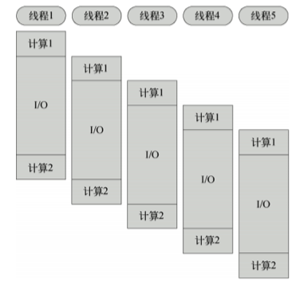
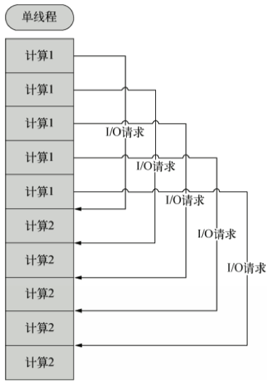
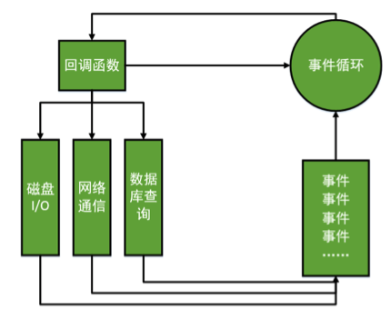

Title: Node.js 概述
Date: 2017-05-11 09:00:27
Category: Linux
Tags: JavaScript, Node.js, 后端

V8引擎
======

* 用于Chrome浏览器的 JS 解释部分
* 没有历史包袱，没有同步I/O。不会出现一个同步I/O导致事件循环性能急剧降低的情况。
* V8性能足够好，远远比Python、Ruby等其他脚本语言的引擎快。
* JavaScript语言的闭包特性非常方便，比C中的回调函数好用。

总览
====

* Node.js是一个让JavaScript运行在服务器端的开发平台
* Node就是一个js的执行环境
* Node.js不是一种独立的语言，与PHP、JSP、Python、Perl、Ruby的“既是语言，也是平台”不同，Node.js使用JavaScript进行编程，运行在JavaScript引擎上（V8）
* 与PHP、JSP等相比，Node.js跳过了Apache、Naginx、IIS等HTTP服务器，它自己不用建设在任何服务器软件之上。Node.js的许多设计理念与经典架构（LAMP）有着很大的不同，可以提供强大的伸缩能力。
* Node.js哲学，花最小的硬件成本，追求更高的并发，更高的处理性能。
* Node.js 没有 web 容器

特点
===

## Node.js如何解决服务器高性能瓶颈

### 单线程

* 这是Node.js不健壮的原因, 只要这个线程崩溃了, 所有的用户都崩溃了。

#### 传统服务器语言

* 在Java、PHP或者.net等服务器端语言中，会为每一个客户端连接创建一个新的线程。而每个线程需要耗费大约2MB内存。也就是说，理论上，一个8GB内存的服务器可以同时连接的最大用户数为4000个左右。要让Web应用程序支持更多的用户，就需要增加服务器的数量，而Web应用程序的硬件成本当然就上升了。

*示意图*

#### Node.js

* Node.js不为每个客户连接创建一个新的线程，而仅仅使用一个线程。当有用户连接了，就触发一个内部事件，通过非阻塞I/O、事件驱动机制，让Node.js程序宏观上也是并行的。使用Node.js，一个8GB内存的服务器，可以同时处理超过4万用户的连接。另外，单线程的带来的好处，还有操作系统完全不再有线程创建、销毁的时间开销。

*示意图*

### 非阻塞I/O

#### 传统

* 当在访问数据库取得数据的时候，需要一段时间。在传统的单线程处理机制中，在执行了访问数据库代码之后，整个线程都将暂停下来，等待数据库返回结果，才能执行后面的代码。也就是说，I/O阻塞了代码的执行，极大地降低了程序的执行效率。

#### Node.js哲学

* 由于Node.js中采用了非阻塞型I/O机制，因此在执行了访问数据库的代码之后，将立即转而执行其后面的代码，把数据库返回结果的处理代码放在回调函数中，从而提高了程序的执行效率。
* 当某个I/O执行完毕时，将以事件的形式通知执行I/O操作的线程，线程执行这个事件的回调函数。为了处理异步I/O，线程必须有事件循环，不断的检查有没有未处理的事件，依次予以处理。
* 阻塞模式下，一个线程只能处理一项任务，要想提高吞吐量必须通过多线程。而非阻塞模式下，一个线程永远在执行计算操作，这个线程的CPU核心利用率永远是100%。所以，这是一种特别有哲理的解决方案：与其人多，但是好多人闲着；还不如一个人玩命，往死里干活儿。

### 事件驱动

* 这是Node.js的核心
* 在Node中，客户端请求建立连接，提交数据等行为，会触发相应的事件。在Node中，在一个时刻，只能执行一个事件回调函数，但是在执行一个事件回调函数的中途，可以转而处理其他事件（比如，又有新用户连接了），然后返回继续执行原事件的回调函数，这种处理机制，称为“事件环”机制。
* Node.js底层是C++（V8也是C++写的）。底层代码中，近半数都用于事件队列、回调函数队列的构建。用事件驱动来完成服务器的任务调度。

*示意图*

### 总结

* 这三个特点其实就是一个事儿的不同方面
* 单线程的好处, 减小了内存开销, 操作系统的内存换页面, 如果某一个事情，进入了，但是被I/O阻塞了，所以这个线程就阻塞了。
* 非阻塞I/O， 不会傻等I/O语句结束，而会执行后面的语句。非阻塞就能解决问题了么？比如执行着小红的业务，执行过程中，小刚的I/O回调完成了，此时怎么办？？
* 事件机制，事件环，不管是新用户的请求，还是老用户的I/O完成，都将以事件方式加入事件环，等待调度。
* 说是三个特点，实际上是一个特点，离开谁都不行，都玩儿不转了。Node.js很像抠门的餐厅老板，只聘请1个服务员，服务很多人。结果，比很多服务员效率还高。Node.js中所有的I/O都是异步的，回调函数，套回调函数。

适合业务
=======

### 擅长I/O, 不擅长计算

* Node.js最擅长的就是任务调度，如果你的业务有很多的CPU计算，实际上也相当于这个计算阻塞了这个单线程，就不适合Node.js开发
* 当应用程序需要处理大量并发的I/O，而在向客户端发出响应之前，应用程序内部并不需要进行非常复杂的处理的时候，Node.js非常适合。Node.js也非常适合与web socket配合，开发长连接的实时交互应用程序。

### 应用场景

* 用户表单收集
* 考试系统
* 聊天室
* 图文直播
* 提供JSON的API（为前台Angular使用）

### 地位

* Node无法挑战PHP、JSP等老牌后台语言
* Node.js本是就是极客追求性能极致的产物，缺少了很多服务器的健壮考量。所以Node不可能应用在银行、证券、电信等需要极高可靠性的业务中。
* 创业型公司（正处于A轮、B轮）非常爱使用Node做核心业务
* 成熟大企业，基本上都是用Node实现某一方面的功能
    * 知乎用了一个Node进程，跑起了“站内信”功能
    * 百度的很多表单，是用Node保存到数据库的

Node.js与其他服务器平台重大区别
===========================

### 没有web容器

* 也就是不存在根目录的概念, 没有任何文件夹的概念
* Node.js中的路由设计非常牛逼
    * 擅长做顶层路由设计
    * URL和真实物理文件，是没有关系的。URL是通过了Node的顶层路由设计，呈递某一个静态文件的。
* 让Node.js提供一个静态服务都很难

写在最后
=======

## Node.js的编程精髓

* 所有的都是异步处理, 回调是 Node.js 编程的精髓
* 内层函数的数据不是 return 返回的, 而是通过调用高层函数提供的回调函数实现数据的传递的. 
* 内层函数通过把数据作为回调函数的参数来传回高层函数的
* 因为Node.js中全是回调函数, 所以自己封装的函数, 如果有异步方法, 比如I/O操作, 那么就要用回调函数的方法封装.

