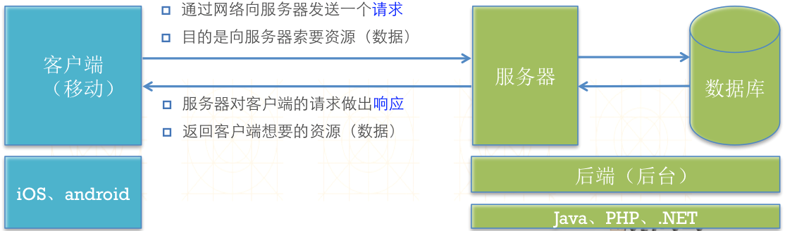
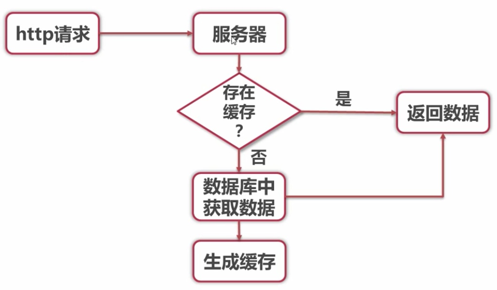
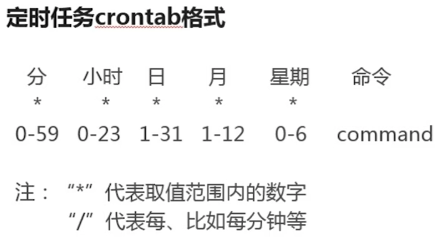

Title: PHP 开发 App 接口
Date: 2017-05-08 07:27:14
Category: PHP
Tags: PHP, 后端

# App接口简介

## App接口介绍

* App(通信)接口定义
  * 接口地址: url
  * 接口文件: 服务器php文件(处理一些业务逻辑) 
  * 接口数据: 服务器返回的json、xml

## App如何进行通信

## 通信格式区别(json、xml对比)
  * 可读性方面: xml有更清晰的结构
  * 生成数据方面: json更简单易用
  * 传输速度方面: json更节省流量

## App接口做的哪些事儿
  * 获取数据: 从数据库中或缓存中获取数据, 然后通过接口数据返回给客户端
  * 提交数据: 通过接口提交数据给服务器, 然后服务器入库处理, 或其他处理

# 封装通信接口方法

## JSON方式封装接口数据方法
* PHP生成JSON数据: json_encode(只接受 uft-8 编码)
* 通信数据标准格式的必要字段
    * code: 状态码
    * message: 提示信息(数据返回成功、 邮箱格式不正确等等) 
    * data: 具体数据

## XML方式封装接口数据方法
* PHP生成XML数据
    * 方式1: 组装字符串
    * 方式2: 使用系统类(DOMDocument、XMLWriter、SimpleXML)
* XML方式封装接口数据方法
    * 封装方法
    * data数据分析

## 综合通信方式封装

# 核心技术

## 缓存技术

* 目的: 减小服务器的压力
* 静态缓存: 保存在磁盘上的静态文件, 用PHP生成数据放入静态文件中
* Memcache、redis
* PHP操作缓存
    * 1. 生成缓存
    * 2. 获取缓存
    * 3. 删除缓存

## Memcache、redis
### 基本了解
* Memcache和Redis都是用来管理数据的
* 他们数据都是存放在内存里的
* Redis可以定期将数据备份到磁盘中(持久化)
* Memcache只是简单的k/v缓存
* Redis不仅仅支持简单的k/v类型的数据, 同时还提供list, set, hash等数据结构的存储

### redis数据操作(终端)
* 1. 开启redis客户端: redis-server 6379.conf
* 2. 设置缓存值: set key value
* 3. 获取缓存数据: get key
* 4. 设置过期时间: setex key time(s) ‘cache’
* 5. 删除缓存: del key

### redis数据操作(php)
* 1. 安装phpredis扩展
* 2. php链接redis服务: connect
* 3. set: 设置缓存
* 4. get: 获取缓存

### PHP操作Memcache
* 1. 安装memcache扩展
* 2. 连接服务: connect
* 3. set: 设置缓存
* 4. get: 获取缓存

## 定时任务
### 如何设置定时任务常用命令

* 1. 定时任务服务提供crontab命令来设定服务
* 2. crontab -e: 编辑某个用户的cron服务
* 3. crontab -l: 列出某个用户cron服务的详细内容
* 4. crontab -r: 删除每个用户的cron服务

### 如何定时运行PHP程序

