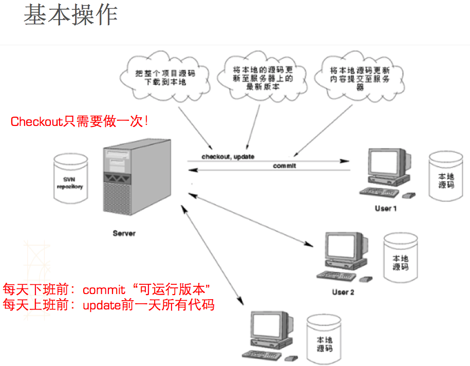
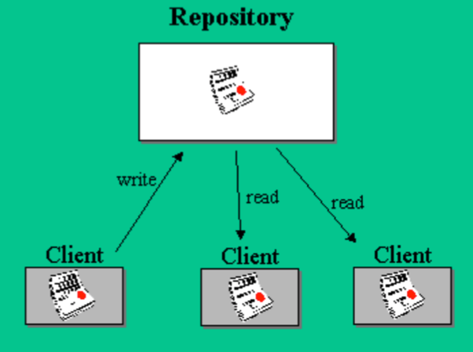

Title: SVN 基本操作
Date: 2017-05-16 23:00:56
Category: SVN
Tags: SVN, 源代码管理

*基本操作原理图*



*SVN版本管理架构模式*



SVN客户端常用命令
===============

```bash
# 下载服务器的代码到本地 （简写svn co）
svn checkout
```

```bash
# 将改动的文件提交到服务器（简写svn ci）
svn commit
```

```bash
# 更新服务器的代码到本地 （简写svn up）
svn update
```

```bash
# 向本地的版本控制库中添加新文件
svn add
```

```bash
# 从本地的版本控制库中删除文件（简写svn del、svn rm）
svn delete
svn remove
```

```bash
# 移动文件或者目录或文件更名
svn move
```

```bash
# 创建纳入版本控制下的新目录
svn mkdir
```

```bash
# 撤销之前的一切修改
svn revert
```

```bash
# 将两个版本之间的差异合并到当前文件
svn merge
```

```bash
# 查看文件的详细信息
svn info
```

```bash
# 查看不同版本的区别
svn diff
```

```bash
# 查看日志信息
svn log
```

```bash
# 列出版本库下的文件和目录列表
svn list
```

```bash
# 查看文件状态（简写svn st）
svn status
# 状态说明
' ' 没有修改
'A' 被添加到本地代码仓库
'C' 冲突
'D' 被删除
'I' 被忽略
'M' 被修改
'R' 被替换
'X' 外部定义创建的版本目录
'?' 文件没有被添加到本地版本库内
'!' 文件丢失或者不完整（不是通过svn命令删除的文件）
'~' 受控文件被其他文件阻隔
```

```bash
# 获取帮助信息（比如svn help ci）
svn help
```

```bash
# 加锁
svn lock
```

```bash
# 解锁
svn unlock
```

常见操作详细解析
=============

## 检出

```bash
# 将项目检出（下载） 至本地
# 如果省略路径，就下载到命令行当前所在的路径
svn checkout URL  [PATH]
svn co URL  [PATH]
# 常用方式
svn checkout URL --username=xxx --password=xxx
```

## 提交

```bash
# 将改动过的文件提交至服务器
# 如果省略路径，将命令行所在路径中所有改动过的文件提交到服务器
svn commit  -m "注释"  [PATH]
svn ci  -m "注释"  [PATH]
```

## 添加

```bash
# 提交一个新建的文件到服务器，需要2个步骤
# 添加新建的文件到本地的版本控制库中：
svn add PATH

# 提交刚才的添加操作到服务器：
svn commit

# 如果直接提交一个没有添加到本地版本控制库中的文件，会报下面的错误
is not a working copy
```

## 删除

```bash
# 删除服务器上的某个文件，需要做2个步骤
# 将文件从本地的版本控制库中移除：
svn delete PATH
# 或
svn remove PATH

# 提交刚才的删除操作到服务器：
svn commit
```

## 更新

```bash
# 将服务器的最新代码更新到本地
# 如果省略路径，就更新命令行所在路径的所有内容
svn update [PATH]
# 将文件恢复至某个版本
svn update -r 版本号 [PATH]
```

使用SVN总结
==========

* 只要有改动就 `commit`
* 只要有提交就 `update`

## 关于版本回退

```bash
# 不小心写错了很多东西，想撤销所写的东西（还未把修改提交到服务器）
svn revert

# 不小心删错了文件，想把文件恢复回来（还未把删除提交到服务器）
svn revert

# 不小心写错了很多东西，想撤销所写的东西（已经把修改提交到服务器）
svn update -r 版本号

# 不小心删错了文件，想把文件恢复回来（已经把删除提交到服务器）
svn update -r 版本号
```


