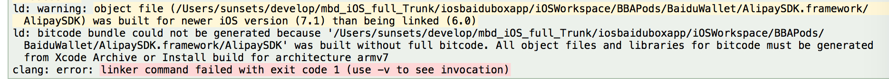
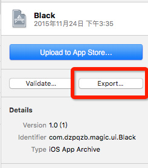
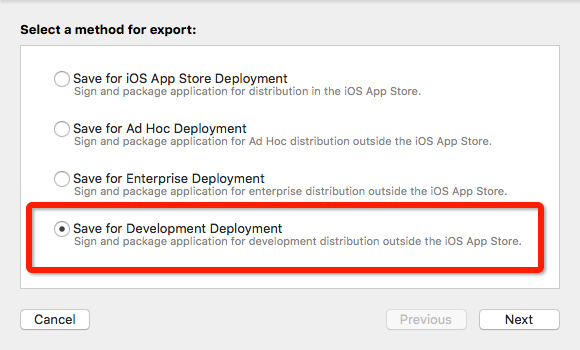
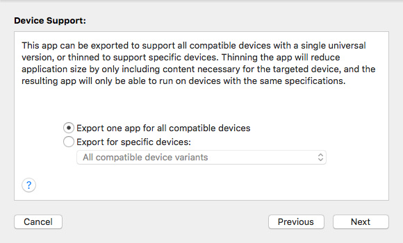
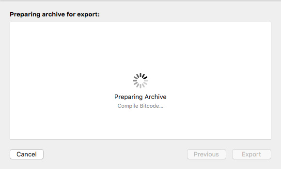
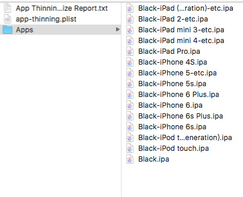

Title: bitcode 设置
Date: 2018-05-12 08:21:28
Category: Xcode
Tags: Xcode

# 打包相关设置
* Build Settings -> Enable Bitcode 设置为 Yes
* Build Settings -> Other C Flags 中添加 `-fembed-bitcode`
* 这个设置不止要在app中设置，同样你也必须在编译库的时候使用。而且需要注意的是该参数, Xcode只在archive模式下添加
* xcodebuild archive 命令
* xcodebuild build 命令. 但是要加入一些特殊编译参数

```bash
xcodebuild BITCODE_GENERATION_MODE=bitcode OTHER_CFLAGS="-fembed-bitcode" ONLY_ACTIVE_ARCH=NO -configuration "Release" -target "${TARGET_NAME}" -sdk iphoneos clean build
xcodebuild BITCODE_GENERATION_MODE=bitcode OTHER_CFLAGS="-fembed-bitcode" -configuration "Release" -arch "x86_64" -target "${TARGET_NAME}" -sdk iphonesimulator clean build
```

# 检测是否打开Bitcode
* 检查 bitcode 段
* .a (otool -arch armv7 -l xxxx.a | grep __bitcode | wc -l). 如果当前库支持.a文件则会输出一个数字
* app, framework (otool -l xxxx | grep \_\_LLVM | wc -l). 当你的framework使用过lipo命令，进行拆解和合并之后，需要指定指令集进行检查才可以 (otool -arch armv7 -l xxxx | grep \_\_LLVM | wc -l)
* 这些方法只供参考, 以最终检查结果为准

# 最终检查
* 如果您是一个APP，可以直接进行Archive打包，如果是一个库，则建议建一个Demo工程进行打包，记得要打开bitcode设置。
* 检查点1: 连接是否报错. 如果有任何一个库没有打开bitcode链接，将会出现类似下方的错误。只要链接过了，那么基本上OK了。


    
* 检查点2: 使用开发模式到处ipa. 



    
*选择出包方式(第二种)*


    
*Compiling Bitcode*

    
*最终输出 ipa 包*


# To Do

* 下一步要做什么: 深入研究 App 的大小的优化. 主要从以下两方面考虑
    * 资源文件
    * 二进制文件
