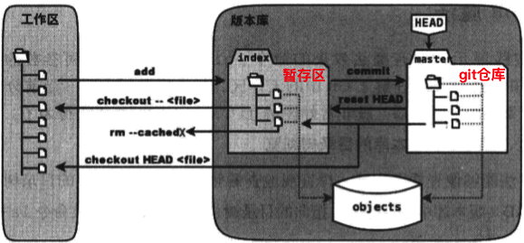
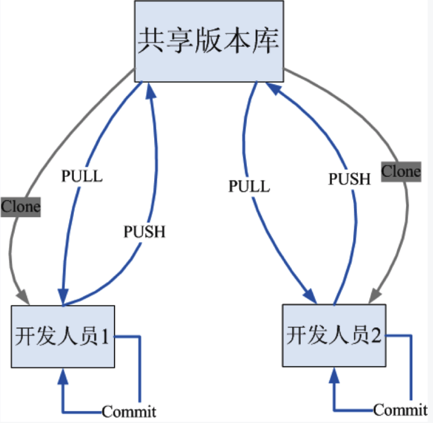
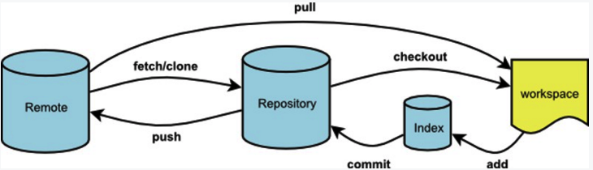
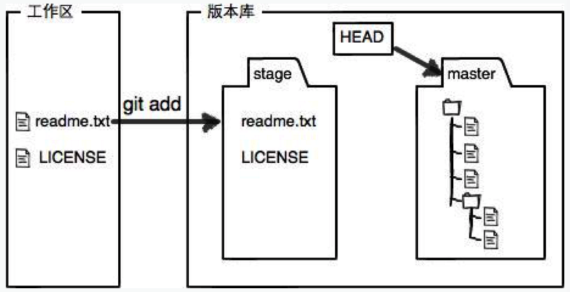
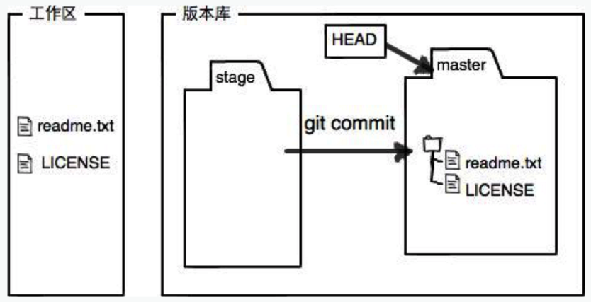
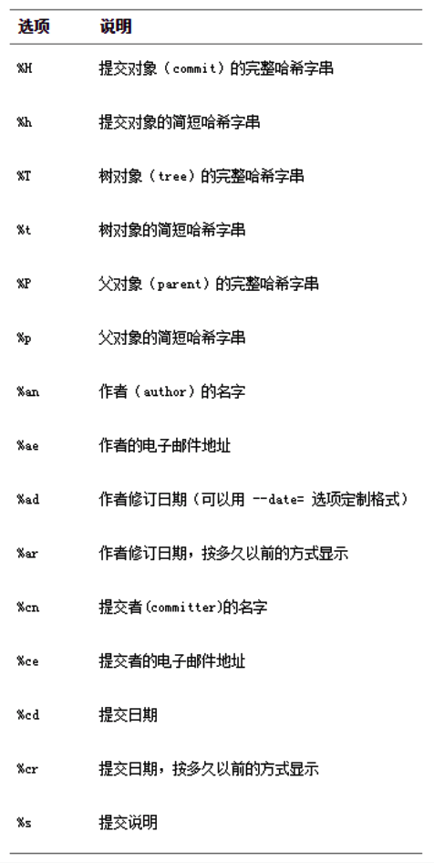
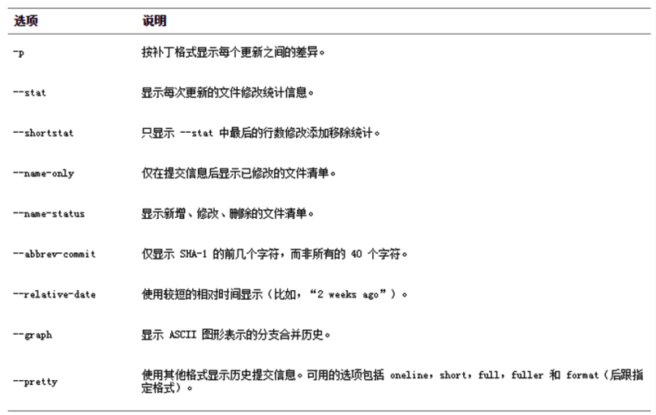
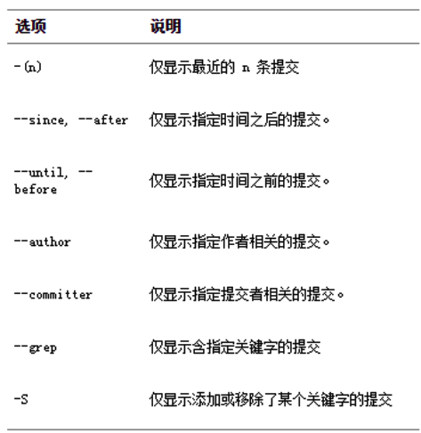

Title: git 常用命令
Date: 2017-05-07 14:11:56
Category: git
Tags: git, 源代码管理

*git核心命令工作示意图*







* git帮助

```bash
git help <verb>
git <verb> --help
man git-<verb>
git help
git help 其他指令
```

* 初始化一个本地仓库，生成一个.git目录，用于维护版本信息

```
# 初始化可以在一个空文件执行, 也可以在一个非空文件执行
git init
git init 仓库路径
# 初始化共享仓库, 共享仓库不能直接操作, 必须clone到本地
git init --bare
# Git 会自动修改该仓库目录的组权限为可写
git init --bare --shared
```

* 克隆远程仓库到本地

```bash
# 下载远程仓库到当前路径
git clone 仓库的URL
# 下载远程仓库到特定路径
git clone 仓库的URL 存放仓库的路径
# 克隆时, 创建一个裸仓库(即一个不包含当前工作目录的仓库)
git clone --bare my_project my_project.git
```

* 下载远程仓库的最新信息到本地仓库, 注意它与git fetch的区别

```bash
# git pull <远程主机名> <远程分支名>:<本地分支名>
git pull
```

* 将本地的仓库信息推送到远程仓库

```bash
git push
git push --force # 强制推送
```

* git仓库的忽略处理, 指定哪些文件不纳入版本库的管理. 把文件修改或者新添加的文件添加到暂存区域.  git add 命令使用文件或目录的路径作为参数; 如果参数是目录的路径，该命令将递归 地跟踪该目录下的所有文件

```bash
touch .gitignore # 或使用已有的.gitignore文件
git add .gitignore
git commit -m "进行忽略操作" .gitignore
```

*.gitignore 格式规范*

```bash
# 所有空行或者以 # 开头的行都会被 Git 忽略。
# 可以使用标准的 glob 模式匹配。
# 匹配模式可以以(/)开头防止递归。
# 匹配模式可以以(/)结尾指定目录。
# 要忽略指定模式以外的文件或目录，可以在模式前加上惊叹号(!)取反。
```

> 所谓的 glob 模式是指 shell 所使用的简化了的正则表达式。 星号()匹配零个或多个任意字符;[abc] 匹配 任何一个列在方括号中的字符(这个例子要么匹配一个 a，要么匹配一个 b，要么匹配一个 c);问号(?)只匹配一个任意字符;如果在方括号中使用短划线分隔两个字符，表示所有在这两个字符范围内的都可以匹配(比如 [0-9] 表示匹配所有 0 到 9 的数字)。 使用两个星号\*\*示匹配任意中间目录，比如a/**/z 可以匹配 a/z, a/b/z 或 a/b/c/z等。

* 配置该仓库的用户名和邮箱

```
git config user.name "manager" 
git config user.email "manager@qq.com"
```

* 配置全局用户名和邮箱

```
git config --global user.name "Katie-Liu"
git config --global user.name "Katie-Liu@126.com"
```

* 配置文本编辑器

```bash
# 当Git需要你输入信息时会调用它, Git默认的是vim
git config --global core.editor vim
```

* 配置信息

```bash
# 查看当前所有配置信息
git config -l # list
# 编辑当前配置信息
git config -e # edit 使用vim
# 检查某一项配置
git config user.name
```

* 查看git仓库状态

```
# 使用git status -s
XY
X shows the status of the index
Y shows the status of the work tree
For untracked paths, XY are ??
Other status codes can be interpreted as follows:
o   ' ' = unmodified
o   M = modified
o   A = added
o   D = deleted
o   R = renamed
o   C = copied
o   U = updated but unmerged
Ignored files are not listed, unless --ignored option is in effect, in which case XY are !!.
```

```
# 红色表示该文件并没有被git仓库管理, 还有其他可能的含义
# 绿色表示该文件已被添加到git的暂缓区中
git status
git status 文件名
git status -s
```

* 使用git status -s显示状态的含义说明

> 新添加的未跟踪文件前面有 ?? 标记，新添加到暂存区中的文件前面有 A 标记，修改过的文件前面有 M 标记。 你可能注意到了 M 有两个可以出现的位置，出现在右边的 M 表示该文件被修改了但是还没放入暂存区，出现在 靠左边的 M 表示该文件被修改了并放入了暂存区。

* 总结: `左边`表示`暂存区`, `右边`表示`工作区`
* 将工作区的文件添加到git仓库的暂缓区, 不管是新建文件还是修改了的文件, 都需要再次添加

```bash
# 跟文件名或文件夹名
git add . # 常用
git add xxx
```





* 提交到本地git仓库, 把暂存区域的所有内容提交到当前分支,  每一次运行提交操作，都是对你项目作一次快照，以后可以回到这个状态，或者进行比较。

```bash
# xxx 文件名或文件夹名, 也可以不写, 表示提交所有
git commit -m "注释" xxx
# 尽管使用暂存区域的方式可以精心准备要提交的细节，但有时候这么做略显繁琐。 Git 提供了一个跳过使用暂存区域的方式，只要在提交的时候，给 git commit 加上 -a 选项，Git 就会自动把所有已经跟踪过的文件暂存起 来一并提交，从而跳过 git add 步骤
git commit -a -m '注释'
```




* 撤销操作

> 在任何一个阶段都有可能想要撤消某些操作。注 意，有些撤消操作是不可逆的。 这是在使用 Git 的过程中，会因为操作失误而导致之前的工作丢失的少有的几个地方之一。

```bash
# 提交完了才发现漏掉了几个文件没有添加，或者提交信息写错了。 此时，可以运行带有 --amend 选项的提交命令尝试重新提交. 这个命令会将暂存区中的文件提交。如果自上次提交以来你还未做任何修改(如果在上次提交后马上执行了此命令)，那么快照会保持不变，而你所修改的只是提交信息。只会有一个提交, 第二次提交将代替第一次提交的结果
git commit --amend
```

* 给git命令取别名

```bash
# 当前仓库别名
git config alias.st "status" # status-->st
git config alias.ci "commit -m" # commit -m -->ci

# 全局的别名
git config --global alias.st "status"

# 配置带颜色的log别名
git config --global alias.lg "log --color --graph --pretty=format:'%Cred%h%Creset -%C(yellow)%d%Creset %s %Cgreen(%cr) %C(bold blue)<%an>%Creset' --abbrev-commit"
```

* git中删除文件

> 要从 Git 中移除某个文件，就必须要从已跟踪文件清单中移除(确切地说，是从暂存区域移除)，然后提交。 可以用 git rm 命令完成此项工作，并连带从工作目录中删除指定的文件，这样以后就不会出现在未跟踪文件清 单中了。
>  如果删除之前修改过并且已经放到暂存区域的话，则必须要用强制删除选项 -f(译注:即 force 的首字母)。 这是一种安全特性，用于防止误删还没有添加到快照的数据，这样的数据不能被 Git 恢复。
>  把文件从 Git 仓库中删除(亦即从暂存区域移除)，但仍然希望保留在当前工作目录 中。 换句话说，你想让文件保留在磁盘，但是并不想让 Git 继续跟踪。为达到这一目 的，使用 --cached 选项

```bash
# 后跟文件名, 可以同时跟多个
# 删除只在工作区和暂缓去, 本地仓库并没有删除, 所以我们需要commit
git rm xxx1 xxx2
# 只删除仓库中的文件, 而保留工作目录中的
git rm --cached xxx
# git rm 命令后面可以列出文件或者目录的名字，也可以使用 glob 模式. 注意到星号 * 之前的反斜杠 \， 因为 Git 有它自己的文件模式扩展匹配方式，所以我们不用 shell 来帮忙展开。
git rm log/\*.log # 删除 log/ 目录下扩展名为 .log 的所有文件
git rm \*~ # 删除以 ~ 结尾的所有文件
```

* 移动文件

> Git 并不显式跟踪文件移动操作. 如果在 Git 中重命名了某个文件，仓库中存储的元数据并不会体现出这是一次改名操作。 不过 Git能推断出究竟发生了什么.

```bash
git mv file_from file_to
# 上面一条命令相当于下面三条
mv file_from file_to
git rm file_from
git add file_to
# 有时候用其他工具批处理改名的话，要记得在 提交前删除老的文件名，再添加新的文件名。
```

* 查看版本信息

```bash
# 查看版本信息(基本版) 
# 按提交时间列出所有的更新，最近的更新排在最上面
# 版本号是一个由SHA1生成的哈希值
git log
# 查看指定文件的版本库日志
git log 文件名
# 查看最近的N次信息
git log -N
# 显示每次提交的内容差异, 当进行代码审查，或者快速浏览某个搭档提交的 commit 所带来的变化的时候，这个参数就非常有用了。
git log -p
# 看每次提交的简略的统计信息，可以使用 --stat 选项. --stat 选项在每次提交的下面列出额所有被修改过的文件、有多少文件被修改了以及被修改过 的文件的哪些行被移除或是添加了
git log --stat
# HEAD指向当前所在的分支, 可以简单地使用 git log 命令查看各个分支当前所指的对象。 提供这一功能的参数是 --decorate。
git log --decorate
# --graph, 引入图形显示方式
git log --graph
git log --oneline --decorate --graph --all
# --all, 显示所有提交历史
git log --all
# --pretty选项可以指定使用不同于默认格式的方式展示提交历史--pretty=[oneline short full fuller format]
git log --pretty=oneline
# --pretty的子选项format，可以定制要显示的记录格式
git log --pretty=format:"%h - %an, %ar : %s"
# 当 oneline 或 format 与另一个 log 选项 --graph 结合使用时尤其有用。 这个选项添加了一些ASCII字符串来形象地展示你的分支、合并历史
git log --pretty=format:"%h %s" --graph
# 一个很实用的 git log 选项是路径(path)， 如果只关心某些文件或者目录的历史提交，可以在 git log 选 项的最后指定它们的路径。 因为是放在最后位置上的选项，所以用两个短划线(--)隔开之前的选项和后面限定 的路径名。
# 一个综合例子: 查看 Git 仓库中，2008 年 10 月期间，Junio Hamano 提交的但未合并的测试文件
git log --pretty="%h - %s" --author=gitster --since="2008-10-01" --before="2008-11-01" --no-merges -- t/
# 查看版本信息(加强版)
# 可以查看版本回退信息
git reflog
```

*git log --pretty=format 常用的选项*



*git log 的常用选项*




*限制git log输出的选项*




* 查看改动, 想知道具体修改了什么地方，可以用 git diff 命令, git diff 将通过文件补丁的格式显示具体哪些行发生了改变

```bash
# 查看当前路径所有文件最新改动的地方
# 查看尚未暂存的文件更新了哪些部分
# 比较的是工作目录中当前文件和暂存区域快照之间的差异， 也就是修改之后还没有暂存起来的变化内容
# 只显示尚未暂存的改动，而不是自上次提交以来所做的所有改动
git diff
# 查看某个文件的最新改动的地方
git diff 文件名
# 查看已暂存的将要添加到下次提交里的内容
# 也就是比较暂存区和git仓库中的内容
git diff --cached
git diff --staged # Git 1.6.1及以上
git diff --tool=vimdiff # 启动图形化差异分析工具
# emerge
# opendiff
# vimdiff
# vimdiff2
# vimdiff3
# 可以使用config的diff.tool属性, 指定默认分析工具
```

* 查看标签

```bash
git tag
```

* 对当前版本打一个标签

```bash
git tag -a MOMO1.0 -m "MOMO1.0"
# 将标签推送到远程代码库中
git push origin MOMO1.0
```

* 使用tag，就能够将项目快速切换到某一个中间状态，例如产品开发线上的某一个稳定版本

```bash
# 签出v1.0标签
git checkout v1.0
# 从检出状态创建v1.0bugfix分支
git checkout -b bugfix1.0
# 上面一条代码相当于: 
git branch bugfix1.0
git checkout bugfix1.0
```

* 版本回退
* 1. 修改已经add到了暂存区, 但是这个修改还没有提交到版本库(取消修改). 例如，你已经修改了两个文件并且想要将它们作为两次独立的修改提交，但是却意外地输入了 git add * 暂存了它们两个。

```bash
# 加上 --hard 选项可以令 git reset 成为一个危险的命令(可能导致工作目录中所有当前进度丢失!)，但这种情况跟工作目录内的文件并不会被修改。 不加选项地调用 git reset 并不危险, 它只会修改暂存区域。
git reset HEAD fileName
```

* 2. 本地仓库修改了内容,并且这个修改已经被提交到版本库(回退到以前的版本)

```bash
# 回退到上一个版本
git reset --hard HEAD^
# 回退到上N个版本
git reset --hard HEAD~N
# 回退到指向的任意版本
git reset --hard 五位数字的版本号 #当然多于5位也可
```

* 3.撤消对文件的修改. 如何方便地撤消修改, 将它还原成上次提交时的样子(或者刚克隆完的样子，或者刚把它放入工作目录时的样子)?

```bash
git checkout -- [file]
```

> `重要`: git checkout -- [file] 是一个危险的命令。 你对那个文件做的任何修改都会消失, 只是拷贝了另一个文件来覆盖它。 除非你确实清楚不想要那个文件了，否则不要使用这个命令。记住，在 Git 中任何已提交的东西几乎总是可以恢复的。 甚至那些被删除的分支中的提交或使用 --amend 选项覆盖的提交也可以恢复。 然而，任何你未提交的东西丢失后很可能再也找不 到了。

