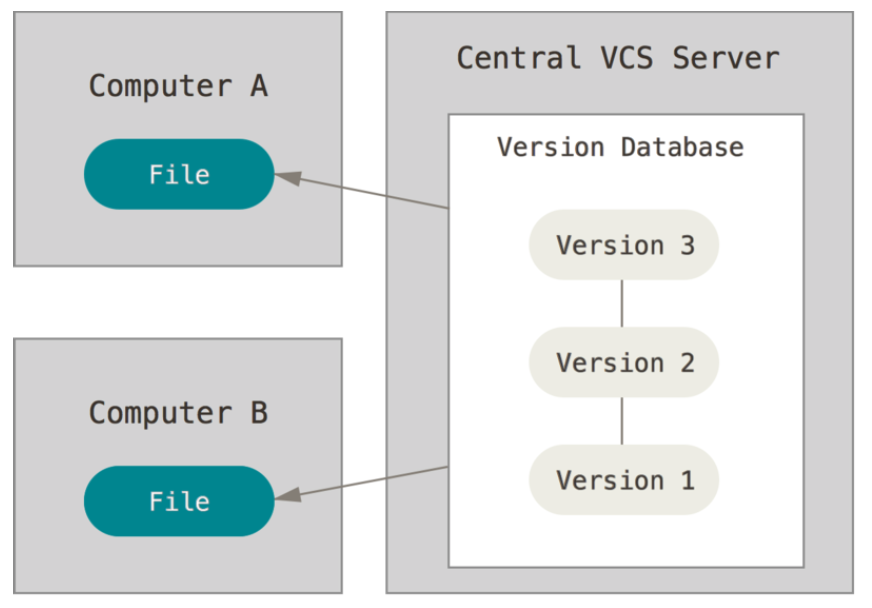
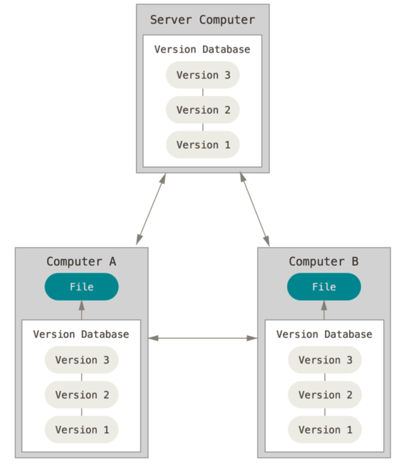
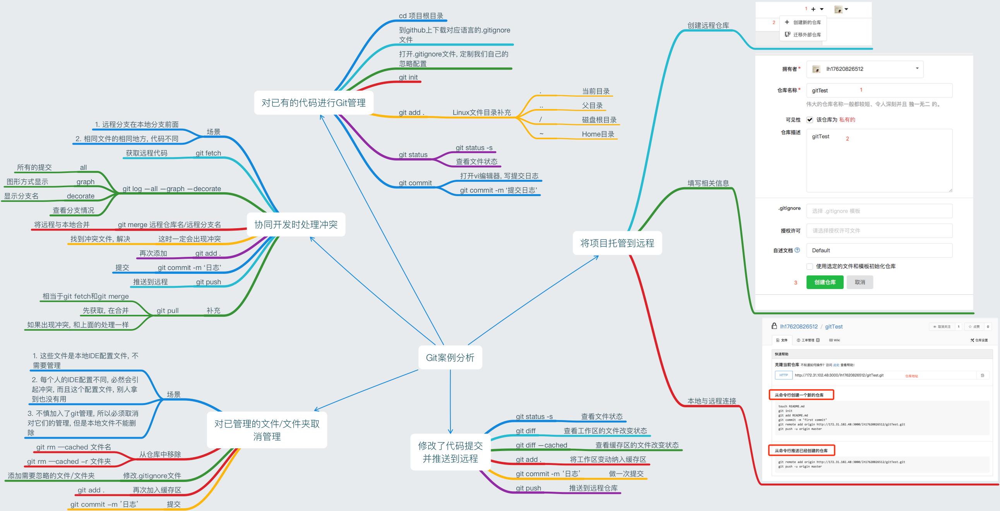

Title: git 快速入门
Date: 2018-05-07 14:11:56
Category: git
Tags: git, 源代码管理

# Git vs SVN

## 系统的架构

**SVN : 集中式**



**Git : 分布式**



> 分布式架构的好处, 近乎所有的操作都是本地操作. 具体体现在: 1. 离线可以工作; 2. 操作速度快

## 对待数据的方式

**SVN : 差异比较**


**Git : 文件快照**


# Git 中文件的三种状态

* 已提交(committed) : 数据已安全的保存在本地数据库中
* 已修改(modified) : 修改了文件, 还没保存在数据库中
* 已暂存(staged) : 对一个已修改的文件的当前版本做了标记, 使之包含在下次提交的快照中


# Git 的基本环境搭建

## 安装 Git for Windows

[下载地址](https://github.com/git-for-windows/git/releases/tag/v2.13.3.windows.1)

使用管理员权限运行, 选择安装目录后, 一直下一步即可!!!

安装成功后, 以后每次都使用 Git Bash 这个程序即可. 打开后界面如下:


# Git 的用户信息配置

* 这个用户信息是用于指示提交是谁做的, 必须配置

```bash
git config --global user.name 'Little-Captain'
git config --global user.email 'littlecaptain@foxmail.com'
```

# Git 核心命令

* Git 帮助命令

```bash
git <verb> --help
git help <verb>
man git-<verb>
```

* Git 初始化命令

```bash
git init
```


# 案例分析

