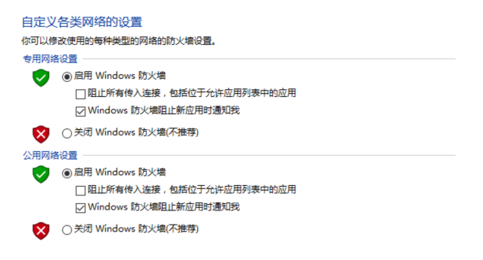
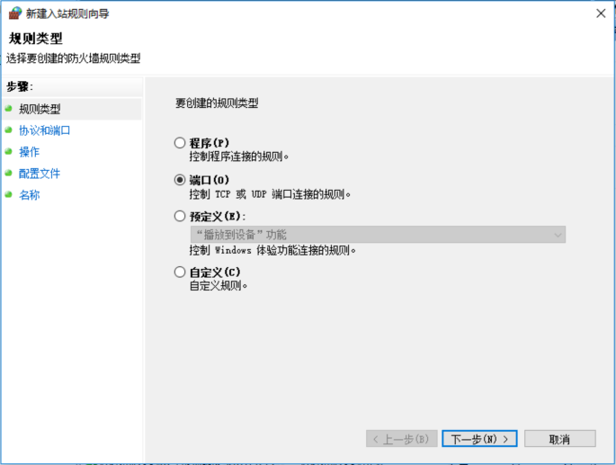

Title: 在 Windows 平台搭建 gogs 服务
Date: 2017-06-11 20:33:11
Category: git
Tags: git, gogs

准备
====

## Git 安装包


[官网](https://git-for-windows.github.io)

## nssm Windows Windows 服务包装软件

[官网](http://nssm.cc)

## gogs 二进制包

[官网](https://gogs.io)

安装
===

## Git

一直下一步就可以了

## nssm

这个不用安装, 解压后, 根据系统使用不同的程序. 要能够在命令行中使用, 必须要将它的路径加入环境变量中

## gogs

将压缩包解压, 然后启动 nssm 程序来包装 gogs, 包装流程[参见](https://gogs.io/docs/installation/run_as_windows_service). 

### 防火墙配置

* 不配置好防火墙, 本机外是没法访问的.


** 启动或关闭 Windows 防火墙 **



** 高级设置 **



剩下的就是打开浏览器, 访问 gogs 服务了!

注意
===

我们在 clone 时, 需要输入密码, 以后可能还要输入, 解决方案有两个, 这两个其实就是一个

## 方案1

```bash
# 这样以后任何时候都不会再叫你输入账号密码了
git clone http://用户名:密码@仓库地址
```

## 方案2

这个方案是在没有采用方案1的情况下的不就方案. 
打开.git目录下config文件, 将url替换为方案1采用的形式即可


