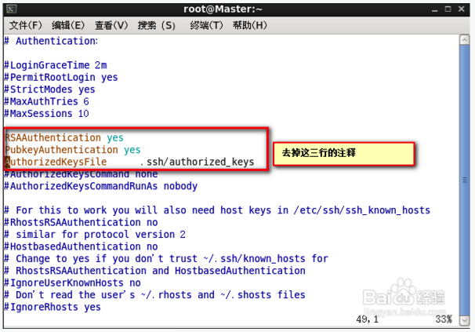

Title: 搭建 git 服务器
Date: 2017-05-07 15:45:42
Category: git
Tags: git, 源代码管理

## 准备篇

### 服务器

* 创建git专用账户git

```bash
sudo adduser --system --shell /bin/bash --user-group git # CentOS
sudo adduser git ssh
sudo passwd git  
```

* 修改git账户的home目录(有需求才改)

```bash
# 当然可以直接修改/etc/passwd文件
usermod -d /tmp git
```

* 安装相关软件(在任何账户都可)

```bash
sudo apt-get update
sudo apt-get install git-core openssh-server openssh-client
sudo apt-get install python-setuptools
```

* 进入`git账户`, 安装gitosis

* 1.获取

```bash
git clone https://github.com/res0nat0r/gitosis.git
```

* 2.进入gitosis目录安装gitosis

```bash
sudo python setup.py install
```

> 安装完gitosis, 并没有任何仓库, 我们还要用管理员的SSH key公钥来初始化gitosis

### 管理员主机

* 生成 SSH key

```bash
# -P后面的代表密码, ''表示无密码
# 在生成时, 为新的key指定路径和名称, 不要覆盖.ssh目录下已有的key
ssh-keygen -t rsa -P ''
```

* 将刚刚生成的SSH key加入ssh-agent, 这一步一定不要忘记了, 如果忘记以后使用git和服务器通信时, 都会提示输入服务器密码, 而不会使用SSH key验证

```bash
ssh-add ~/.ssh/gitHost
```

* 将SSH key复制到服务器(只要能把公钥复制到服务器都可)

```bash
scp .ssh/gitHost.pub git@192.168.11.116:~/gitHost.pub
```

## 服务器上安装gitosis(git账户下)

* 使用本地主机上传的公钥来对gitosis初始化

```bash
sudo -H -u git gitosis-init < .ssh/gitHost.pub
```

> 初始化完成后, 会在gitosis会将gitHost.pub的内容复制到`.ssh/authorized_keys`中, 所以可以使用管理员主机进行管理了

* 修改目录权限, 不然, 在本地主机clone的项目读写权限不够

```bash
sudo chmod 755 /home/git/repositories/gitosis-admin.git/hooks/post-update
```

> 初始化完后, 默认的仓库在`~/repositories`目录下, `gitosis-admin.git`仓库就是我们管理仓库的专用仓库.

## 管理员配置仓库<span id='3'></span>

* 在管理员主机上clone gitosis-admin.git

```bash
git clone git@server:gitosis-admin.git 
```

> clone下来会有一个gitosis.conf的配置文件和一个keydir的目录。gitosis.conf用于配置用户的权限信息，keydir主要用户存放ssh公钥文件（一般以“用户名.pub”命名，gitosis.conf配置文件中需使用相同用户名），用于认证请求的客户端机器。

* 修改配置文件gitosis.conf, 配置好后推送到服务器才算配置成功, 新增的用户不能立即生效, 服务器端需要重启sshd服务`sudo service sshd restart`

*gitosis.conf格式如下*

```bash
[gitosis]

[group gitosis-admin] #管理员组
members = charn@ubuntu #管理员用户名，需要在keydir目录下找到相应的.pub文件，多个可用空格隔开（下同）
writable = gitosis-admin #可写的项目仓库名，多个可用空格隔开（下同）

[group testwrite] #可写权限组
members = zhangsan #组用户
writable = mytestproject #可写的项目仓库名

[group testread] #只读权限组
members =lisi #组用户
readonly= mytestproject #只读项目仓库名
```

## 管理员新建仓库

* 1.配置管理员仓库的gitosis.conf文件

```bash
[group groupName] # 组
members = memberName # 用户
writable = projectName # 项目名
```

* 2.增加相应的memberName.pub到keydir文件夹
* 3.将更新推送到服务器
* 4.重启服务器的sshd服务

```bash
sudo service sshd restart
```

* 5.在本地新建仓库, 并推送到服务器

```bash
# 新建项目文件夹
mkdir projectName
# 进入
cd projectName
# git初始化
git init
# 加入一些必要文件比如.gitignore和项目文件夹
git add .
# 提交
git commit -m 'initialize project'
# 添加远程仓库地址
git remote add origin git@192.168.11.116:projectName.git
# 设置上游仓库, 并推送上去
git push -u origin master:master
```

> 经过以上步骤, 服务器上的仓库就建立完毕了, 这时就可以在其他客户机上clone仓库了

* 6.测试仓库是否建立成功

```bash
cd ..
# 删除项目文件夹
rm -rf projectName
# 再次克隆远程仓库
git clone git@192.168.11.116:projectName.git
# 进入工程文件件
cd projectName
# 查看分支信息
git branch -a
# 显示结果如下, 表示仓库建立成功
* master
  remotes/origin/HEAD -> origin/master
  remotes/origin/master
```

## 使用GitWeb

> 在本地, 如果你对项目有读写权限或只读权限，你可能需要建立起一个基于网页的简易查看器。 Git 提供了一个叫做 Git Web 的 CGI 脚本来做这项工作。

*Mac上*

```bash
# 启动一个监听 1234 端口的 HTTP 服务器，并且自动打开了浏览器
git instaweb --httpd=webrick
# 完成了工作, 关闭这个服务器
git instaweb --httpd=webrick --stop
```

* 服务器上新建项目仓库. 新建的这个仓库暂时还是空的，不能被客户端clone，还需要对gitosis进行一些配置操作. [参见](#3)

## 坑

*git is not in the sudoers file. This incident will be reported的解决方法*

```bash
# 方法1, 修改git ALL=(ALL) ALL
vim /etc/sudoers
# 方法2
sudo su
echo 'git ALL=(ALL) ALL' >> /etc/sudoers
```

### 建立客户机与服务器SSH无密码登录

* 将本地上传的gitHost.pub手动添加到.ssh/authorzied_keys文件里

```bash
cat gitHost.pub >> .ssh/authorized_keys
// authorized_keys的权限要是600
chmod 600 .ssh/authorized_keys
```

*经过以上所有的步骤, 已经可以通过SSH key在本地主机无秘密链接服务器了*

```bash
ssh git@192.168.11.116
```

*在.ssh文件夹中配置config文件*

```bash
* config文件
host gitHost
user git
hostname 192.168.11.116
port 22
identityfile ~/.ssh/gitHost
```

*这时可以使用简写形式*

```bash
ssh gitHost
```

* 修改服务器的/etc/passwd文件, 禁止用户通过shell登陆

```
# 原本
git:x:122:130::/home/git:/bin/bash
# 修改后
git:x:122:130:,,,:/home/git:/bin/bash
```

* 在使用 `ssh git@192.168.11.116`链接服务器如果提示`REMOTE HOST IDENTIFICATION HAS CHANGED`, 进入`~/.ssh/known_hosts`将`192.168.11.116`相关的rsa都删除
* SSH免密码登录补充

*修改SSH配置文件*

```bash
sudo vim /etc/ssh/sshd_config
```

*修改后*



> 注意: 建立这种登录关系, 如果没有必要不要操作, 因为前面已经建立了git账户的SSH链接, 如果这个也建立, 会出现一些奇怪的现象, 比如在使用git克隆仓库时, 必须使用仓库在服务器上的全路径才能克隆. 其实核心的操作就是不要将客户机的公钥手动追加到authorized_keys中, 如果git链接不成功, 或者链接后还要输服务器密码, 那么这里的其他配置, 是可以用来配置git的SSH链接的

```bash
# 使用全路径才能clone仓库
git clone git@192.168.11.116:~/repositories/gitosis-admin.git
```


