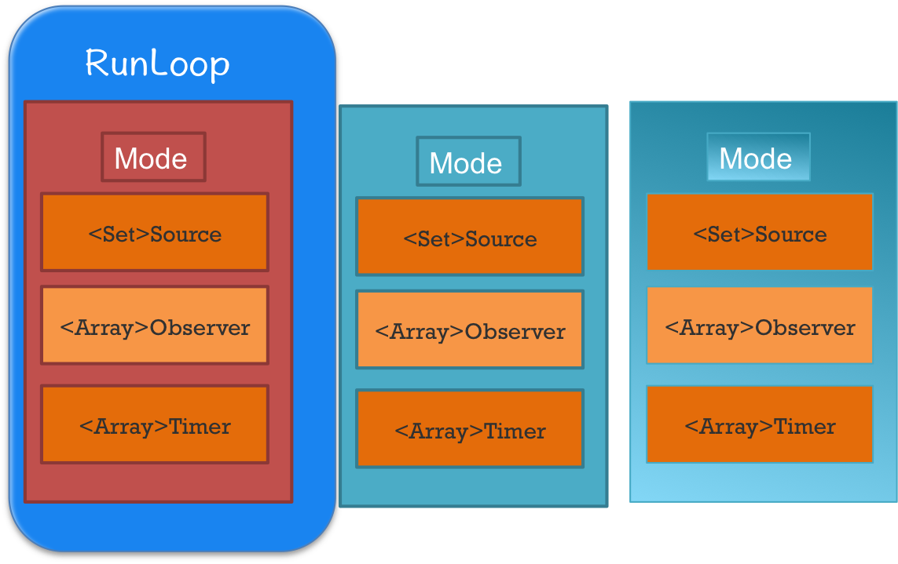
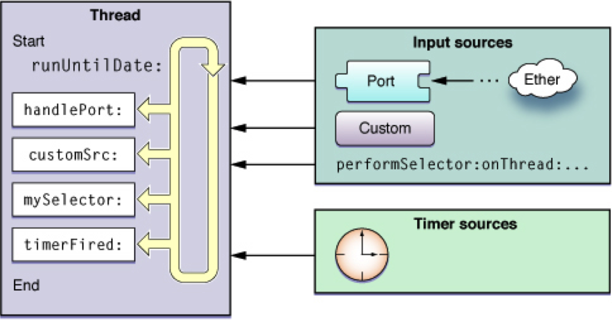
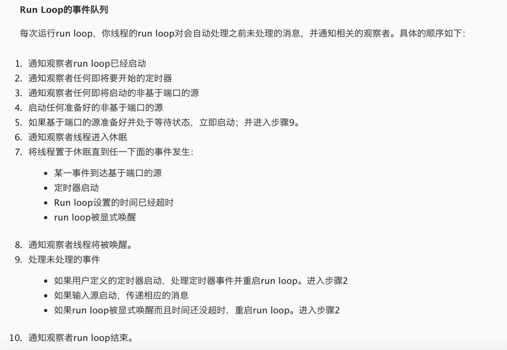
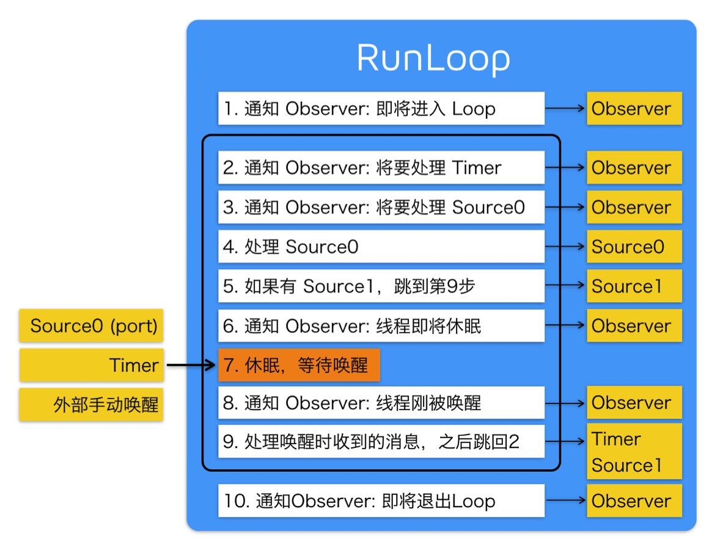

Title: RunLoop 就这一篇
Date: 2017-05-10 19:07:29
Category: iOS
Tags: iOS, 多线程, RunLoop

概念
====

* 字面意思 : 运行循环

*示意图*



基本作用
=======

* 保持程序的持续运行
* 处理App中的各种事件
    * 触摸事件
    * 定时器事件
    * Selector事件
    * …
* 节省CPU资源
* 提高程序性能, 该做事时做事，该休息时休息
* ...

## 如果没有 runloop

```objc
int main(int argc, char * argv[]) {
    NSLog(@"execute main function"); // 程序开始
    return 0; // 程序结束
}
```

## 如果有了 runloop

```objc
int main(int argc, char * argv[]) {
    BOOL running = YES; // 程序开始
    do {
        // 执行各种任务，处理各种事件
             // ......
    } while (running); // 持续运行
    return 0;
}
```

* main 函数里面启动了 RunLoop ，程序并不会马上退出，保持持续运行状态

```objc
int main(int argc, char * argv[]) {
    @autoreleasepool {
        return UIApplicationMain(argc, argv, nil, NSStringFromClass([AppDelegate class]));
    }
}
```

解释

* 第3行代码的UIApplicationMain函数内部就启动了一个 runloop
* UIApplicationMain函数一直不会返回，保持了程序的持续运行
* 这个默认启动的runloop是跟主线程相关联的

RunLoop对象
==========

### iOS中有2套API来访问和使用RunLoop

* NSRunLoop
    * Foundation
    * NSRunLoop 是基于 CFRunLoopRef 的一层 OC 包装
* CFRunLoopRef
    * Core Foundation
    * 要了解RunLoop内部结构，需要多研究CFRunLoopRef层面的API
    * CFRunLoopRef是开源的
* NSRunLoop和CFRunLoopRef都代表着RunLoop对象, 可以相互转换

### 获得RunLoop对象

* Foundation
    * currentRunLoop, 获得当前线程的RunLoop对象
    * mainRunLoop, 获得主线程的RunLoop对象
* Core Foundation
    * CFRunLoopGetCurrent, 获得当前线程的RunLoop对象
    * CFRunLoopGetMain, 获得主线程的RunLoop对象

RunLoop与线程
============

* 每条线程都有唯一的一个与之对应的RunLoop对象
* 主线程的RunLoop已经自动创建好了
* 子线程的RunLoop需要主动创建
* RunLoop在第一次获取时创建，在线程结束时销毁

RunLoop相关类
============

## CFRunLoopModeRef

* RunLoop的运行模式
* 一个 RunLoop 包含若干个 Mode
* 每个Mode又包含若干个Source/Timer/Observer
* 每次RunLoop启动时，只能指定其中一个 Mode，这个Mode被称作 CurrentMode. 这样做主要是为了分隔开不同组的Source/Timer/Observer，让其互不影响
* 系统默认注册了5个Mode
    * kCFRunLoopDefaultMode, App的默认Mode，通常主线程是在这个Mode下运行
    * UITrackingRunLoopMode, 界面跟踪 Mode，用于 ScrollView 追踪触摸滑动，保证界面滑动时不受其他 Mode 影响
    * UIInitializationRunLoopMode, 在刚启动 App 时进入的第一个 Mode，启动完成后就不再使用
    * GSEventReceiveRunLoopMode, 接受系统事件的内部 Mode，通常用不到
    * kCFRunLoopCommonModes, 这是一个占位用的Mode，不是一种真正的Mode

## CFRunLoopSourceRef

* 事件源（输入源）
* 以前的分法
    * Port-Based Sources
    * Custom Input Sources
    * Cocoa Perform Selector Sources
* 现在的分法
    * Source0：非基于Port的
    * Source1：基于Port的

## CFRunLoopRef

* 代表的是 RunLoop 本身

## CFRunLoopTimerRef

* 基于时间的触发器
* 基本上说的就是NSTimer

## CFRunLoopObserverRef

* 观察者
* 能够监听RunLoop的状态改变
* 可以监听的时间点
    * kCFRunLoopEntry, 即将进入Loop
    * kCFRunLoopBeforeSources, 即将处理Source
    * kCFRunLoopBeforeTimers, 即将处理Timer
    * kCFRunLoopBeforeWaiting, 即将进入休眠
    * kCFRunLoopAfterWaiting, 刚从休眠中唤醒
    * kCFRunLoopExit, 即将退出Loop
    * kCFRunLoopAllActivities

RunLoop处理逻辑
==============

*苹果官方版*



*网友翻译版*



*网友整理版*



RunLoop应用
===========

* NSTimer
* PerformSelector
* 自动释放池
* 常驻线程

RunLoop问题集锦
==============

## 什么是RunLoop

* 运行循环
* 它内部就是do-while循环，在这个循环内部不断地处理各种任务(Source、Timer)
* 一个线程对应一个RunLoop
    * 主线程的RunLoop默认已经启动
    * 子线程的RunLoop得手动启动, 调用run方法
* RunLoop只能选择一个Mode启动，如果当前Mode中没有任何Source(Sources0、Sources1)、Timer，那么就直接退出RunLoop
* 通过Observer监听RunLoop的状态

## 自动释放池什么时候释放

* 通过Observer监听RunLoop的状态, 一旦监听到RunLoop即将进入睡眠等待状态, 就释放自动释放池(kCFRunLoopBeforeWaiting)释放内部对象, 然后马上创建一个空的新的自动释放池, 便于下次恢复运行直接使用
* kCFRunLoopEntry
    * 创建一个自动释放池
    * 第一次进入runloop的时候, 需要创建自动释放池
* kCFRunLoopBeforeWaiting, 销毁自动释放池, 创建一个新的自动释放池
* kCFRunLoopExit, 退出runloop的时候, 需要销毁自动释放池

## 如何使用RunLoop？有哪些应用场景？

* 开启一个常驻线程, 让一个子线程不进入消亡状态，等待其他线程发来消息，处理其他事件
* 在子线程中开启一个定时器
* 在子线程中进行一些长期监控
* 可以控制定时器在特定模式下执行
* 可以让某些事件（行为、任务）在特定模式下执行
* 可以添加 Observer 监听 RunLoop 的状态, 比如监听点击事件的处理（在所有点击事件之前做一些事情）

参考
===

[深入理解RunLoop](http://blog.ibireme.com/2015/05/18/runloop/)


