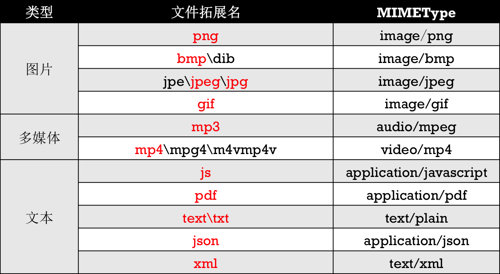

Title: iOS 文件上传
Date: 2017-05-11 14:06:55
Category: iOS
Tags: iOS, 文件处理

步骤
====

## 设置请求头

```objc
[request setValue:@"multipart/form-data; boundary=分割线" forHTTPHeaderField:@"Content-Type"];
```

## 设置请求体

* 非文件参数

```
--分割线\r\n
Content-Disposition: form-data; name="参数名"\r\n
\r\n
参数值
\r\n
```

* 文件参数

```
--分割线\r\n
Content-Disposition: form-data; name="参数名"; filename="文件名"\r\n
Content-Type: 文件的MIMEType\r\n
\r\n
文件数据
\r\n
```

* 结束的标记

```
--分割线--\r\n
```

部分文件的MIMEType
================



获得文件的MIMEType
================

## 利用NSURLConnection

```objc
- (NSString *)MIMEType:(NSURL *)url {
    // 1.创建一个请求
    NSURLRequest *request = [NSURLRequest requestWithURL:url];
    // 2.发送请求（返回响应）
    NSURLResponse *response = nil;
    [NSURLConnection sendSynchronousRequest:request returningResponse:&response error:nil];
    // 3.获得MIMEType
    return response.MIMEType;
}
```

## C语言API

```objc
+ (NSString *)mimeTypeForFileAtPath:(NSString *)path {
	if (![[NSFileManager alloc] init] fileExistsAtPath:path]) {
		return nil;
	}
    
	CFStringRef UTI = UTTypeCreatePreferredIdentifierForTag(kUTTagClassFilenameExtension, (CFStringRef)[path pathExtension], NULL);
    CFStringRef MIMEType = UTTypeCopyPreferredTagWithClass (UTI, kUTTagClassMIMEType);
    CFRelease(UTI);
	if (!MIMEType) {
		return @"application/octet-stream";
	}
    return NSMakeCollectable(MIMEType);
}
```


