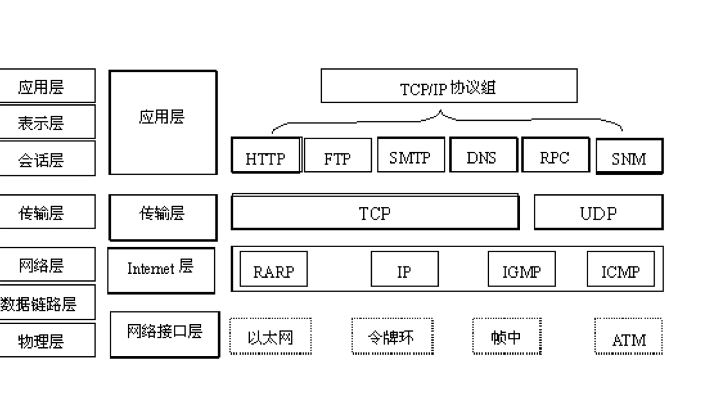
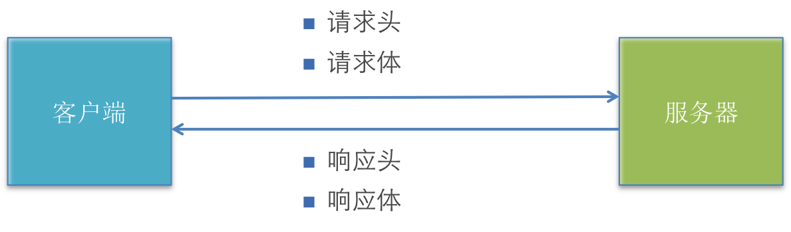
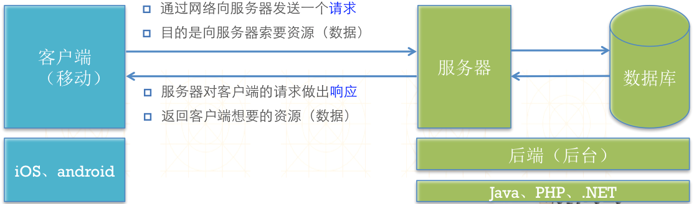
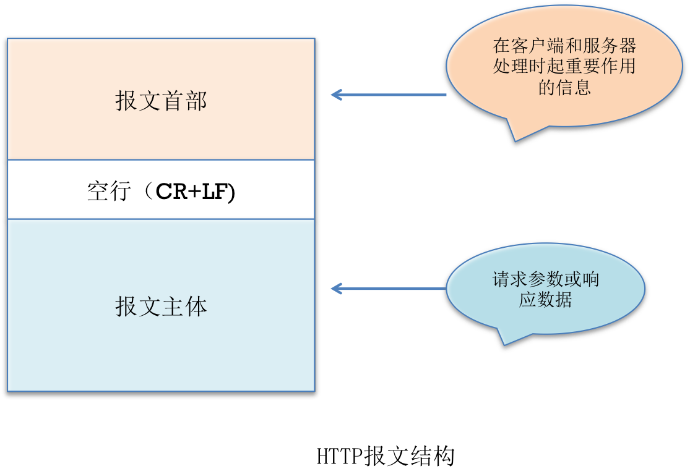
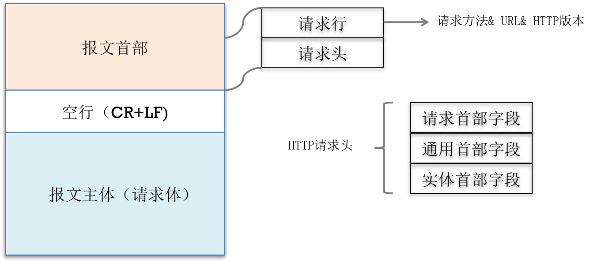
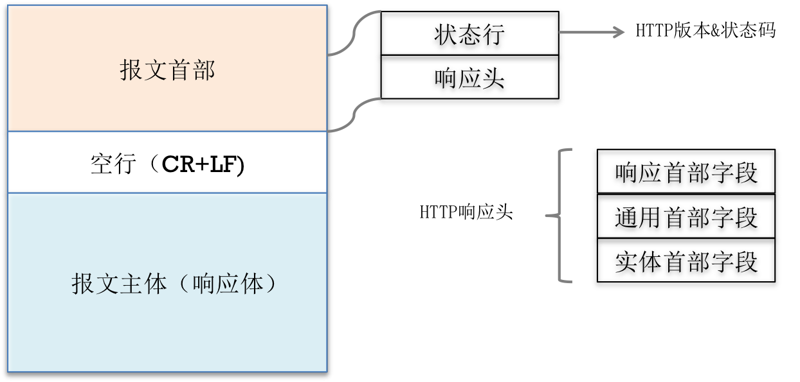

Title: iOS 网络-HTTP
Date: 2017-05-11 14:02:54
Category: iOS
Tags: iOS, 网络

基本概念
=======

## 如何找到服务器?

* 客户端通过URL找到想要连接的服务器

## URL

* Uniform Resource Locator : 统一资源定位符
* 通过1个URL，能找到互联网上唯一的1个资源
* 互联网上的每个资源都有一个唯一的URL
* URL就是资源的地址、位置

### URL的基本格式

* 协议://主机地址/路径
* 协议 : 不同的协议，代表着不同的资源查找方式、资源传输方式
* 主机地址 : 存放资源的主机（服务器）的IP地址（域名）
* 路径 : 资源在主机（服务器）中的具体位置

### URL中常见的协议

#### HTTP

* 超文本传输协议
* 访问的是远程的网络资源
* http://
* http协议是在网络开发中最常用的协议

#### file

* 访问的是本地计算机上的资源
* file://
* 不用加主机地址

#### mailto

* 访问的是电子邮件地址
* mailto:

#### FTP

* 访问的是共享主机的文件资源
* ftp://

## TCP/IP协议簇

* 通常意义上，我们使用的网络是在TCP/IP协议簇的基础上运作的，而HTTP属于它内部的一个子集。

### 计算机与网络设备需要通信，双方就必须要基于相同的方法

* 比如
    * 具体应该如何探测通信目标
    * 由哪一方面发起通信
    * 使用什么语言进行沟通
    * ...
* 所有的这一切都需要规则
* 把这些规则称之为协议（protocol）

### 在协议中规定了很多的各式各样的内容

* 比如
    * 选址方法
    * 双方建立通信的顺序
    * ...
* 常见协议
    * ICMP
    * DNS
    * TCP
    * FTP
    * HTTP
    * SNMP
    * PPPoE
    * IP
    * FDDI
* 通常我们把TCP/IP认为是在IP协议的通信过程中，使用到的协议簇的统称

### TCP/IP 协议簇里面最重要的一点就是分层设计

* 应用层
* 传输层
* 网络层
* 数据链路层

### TCP/IP参考模型

HTTP协议的作用
============

* 超文本传输协议 : Hypertext Transfer Protocol
* 规定客户端和服务器之间的数据传输格式
* 让客户端和服务器能有效地进行数据沟通

HTTP协议的特点
============

* 简单快速
* 因为HTTP协议简单，所以HTTP服务器的程序规模小，因而通信速度很快
* 灵活, HTTP允许传输各种各样的数据

## 版本特点

* 0.9和1.0使用非持续连接 : 限制每次连接只处理一个请求，服务器对客户端的请求做出响应后，马上断开连接，这种方式可以节省传输时间
* 1.1
    * 当前版本
    * 持久连接被默认采用
    * 支持以管道方式同时发送多个请求，以便降低线路负载，提高传输速度。

HTTP的基本通信过程
================

## 完整的HTTP通信可以分为2大步骤

* 请求, 客户端向服务器索要数据
* 响应, 服务器返回客户端相应的数据

*示意图1*

*示意图2*

*示意图3*

## 请求

* 1个完整的由客户端发给服务器的HTTP请求中包含
    * 请求头 : 包含了对客户端的环境描述、客户端请求信息等
    * 请求体 : 客户端发给服务器的具体数据(POST请求才会有)

## 响应

* 客户端向服务器发送请求，服务器应当做出响应，即返回数据给客户端
* 1个完整的HTTP响应中包含
    * 响应头 : 包含了对服务器的描述、对返回数据的描述
    * 响应体 : 服务器返回给客户端的具体数据

### 响应状态码

* 1xx : 响应服务器已接受, 正在处理
* 2xx : 服务器处理成功
    * 200 : OK, 请求成功
* 3xx : 重定向
* 4xx : 客户端错误
    * 400 : 语法错误, 服务器不能理解
    * 401 : 请求没有授权
    * 403 : 资源不可用
    * 404 : 未找到
* 5xx : 服务器错误
    * 500 : 服务器发生了无法预期的错误
    * 503 : 服务器还不能处理客户端这个请求

请求方法
=======

## HTTP/1.1协议中

* http请求的方法
    * GET
    * POST
    * OPTIONS
    * HEAD
    * PUT
    * DELETE
    * TRACE
    * CONNECT
    * PATCH

## 根据HTTP协议的设计初衷，不同的方法对资源有不同的操作方式

* PUT : 增
* DELETE : 删
* POST : 改
* GET : 查
* 仅仅使用 GET 和 POST 就能办到增删改查

## GET和POST对比

### 主要区别表现在数据传递上

#### GET

* 在请求URL后面以?的形式跟上发给服务器的参数，多个参数之间用&隔开
* 由于浏览器和服务器对URL长度有限制，因此在URL后面附带的参数是有限制的，通常不能超过1KB

#### POST

* 发给服务器的参数全部放在请求体中
* POST传递的数据量没有限制, 具体还得看服务器的处理能力

## GET和POST的选择

* 如果要传递大量数据，比如文件上传，只能用POST请求
* GET的安全性比POST要差些, 如果包含机密\敏感信息，建议用POST
* 如果仅仅是索取数据（数据查询），建议使用GET
* 如果是增加、修改、删除数据，建议使用POST

HTTP报文
=======

## HTTP报文细节

*报文结构*

*请求*

*响应*

iOS中发送HTTP请求的方案
====================

## 苹果原生

* NSURLConnection
    * 用法简单，最古老最经典最直接的一种方案
    * 9.0后被废弃
* NSURLSession
    * 功能比NSURLConnection更加强大
    * 苹果目前比较推荐使用这种技术
    * 7.0后推出的技术
* CFNetwork : NSURL*的底层，纯C语言

## 第三方框架

> 为了提高开发效率，建议使用第三方框架

* ASIHttpRequest
    * 功能极其强大
    * 早已停止更新
* AFNetworking
    * 简单易用
    * 提供了基本够用的常用功能
    * 维护和使用者多
* MKNetworkKit
    * 简单易用
    * 维护和使用者少

