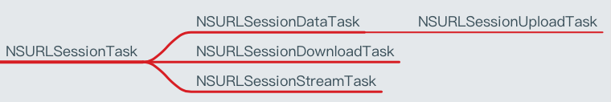

Title: iOS 网络-NSURLSession
Date: 2017-05-11 11:14:37
Category: iOS
Tags: iOS, 网络

Task的类型
=========

使用步骤
=======

* 使用NSURLSession对象创建Task
* 执行Task

常用方法
=======

* sharedSession : 获得共享的Session
* sessionWithConfiguration : 自定义Session

NSURLSessionTask
================

## 常见方法

* suspend, 暂停
* resume, 恢复
* cancel, 取消

## 常用属性
* error, 错误
* response, 响应

NSURLSessionDownloadTask
========================

## 常见方法

* cancelByProducingResumeData

