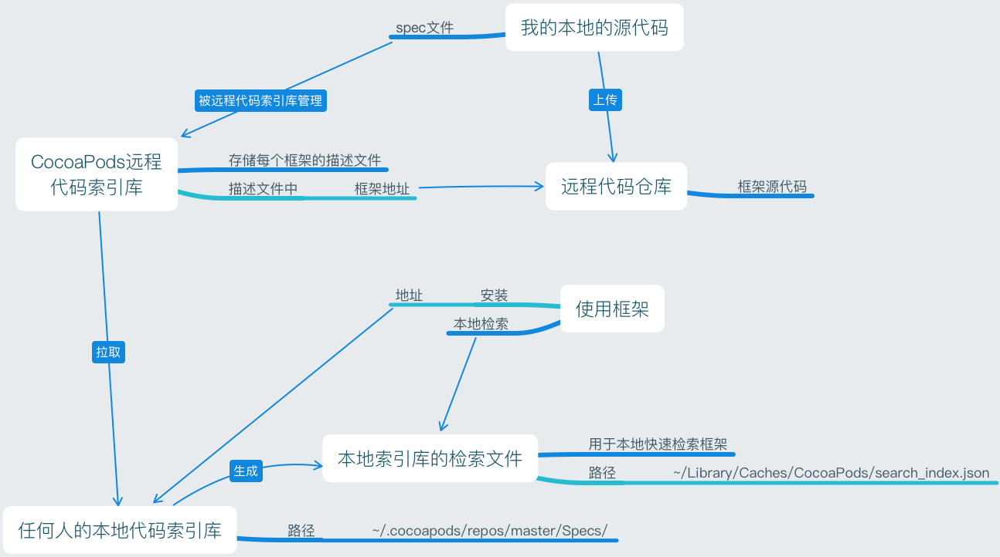
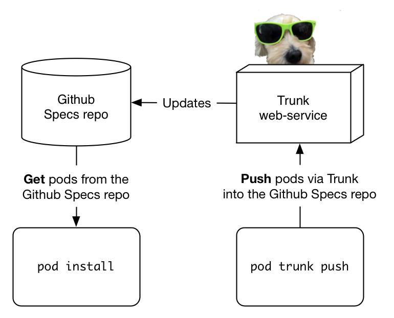
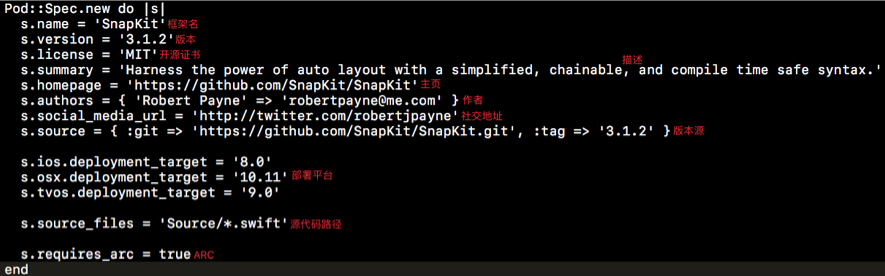

Title: 发布框架到 CocoaPods 上
Date: 2017-05-08 08:16:50
Category: iOS
Tags: CocoaPods

CocoaPods如何管理框架
===================


===================

框架的发布与安装
==============


==============

发布流程
=======

## 1. 注册

```bash
pod trunk register email地址 yourname
```

执行上面的命令后, 你将收到一封邮件, `必须验证`才能进行后续操作

## 2. 查询用户信息

```bash
pod trunk me
```

这条命令将输出你的`个人相关信息`

```
- Name:     XXX
  - Email:    littlecaptain@foxmail.com
  - Since:    January 26th, 22:49
  - Pods:
    - LCDemo
    - LCCategories
    - LCRuntimeTool
    - JFVideoPlayView
    - LCNetworking
  - Sessions:
    - January 26th, 22:49 -      June 17th, 06:08. IP: 119.129.112.135
    - May 2nd, 06:50      - September 12th, 18:21. IP: 112.95.74.156
```

## 3. 生成 spec 文件

```bash
pod spec create gitHub框架地址
```

注意: 在生成文件前先创建框架,为框架取名, `不能`和已有框架`重名`

## 4. 编辑 podspec 文件

*podspec文件基本格式*



## 5. 验证 podspec 文件

```bash
pod spec lint
# 输出详细信息
pod spec lint —verbose
```

注意: 要使用Xcode正式版, 代码不能有警告

## 6. 推送到 CocoaPods 服务器

```bash
pod trunk push
```


