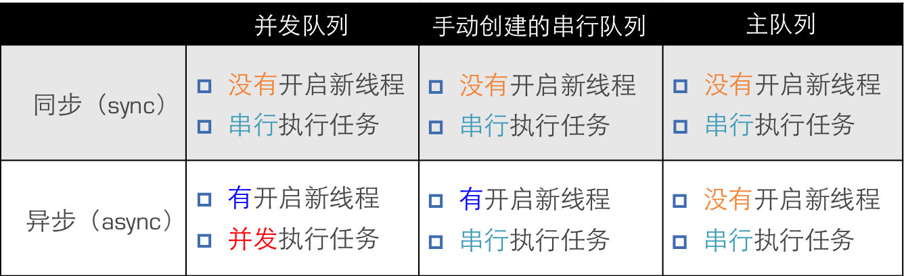

Title: 多线程-GCD总结
Date: 2017-05-10 12:19:44
Category: iOS
Tags: 多线程, iOS, GCD

简介
===

* 全称是Grand Central Dispatch，可译为“宏大的中枢调度器”
* 纯C语言，提供了非常多强大的函数

## GCD的优势

* 苹果公司为多核的并行运算提出的解决方案
* 自动利用更多的CPU内核
* 自动管理线程的生命周期
    * 创建线程
    * 调度任务
    * 销毁线程
* 使用方便 : 程序员只需要告诉GCD想要执行什么任务，不需要编写任何线程管理代码

核心概念
=======

## 任务

* 执行什么操作

## 队列

* 用来存放任务

### 类型

* 并发队列
    * Concurrent Dispatch Queue
    * 可以让多个任务并发（同时）执行
    * 自动开启多个线程同时执行任务
    * 并发功能只有在异步（dispatch_async）函数下才有效
* 串行队列
    * Serial Dispatch Queue
    * 让任务一个接着一个地执行
    * 一个任务执行完毕后，再执行下一个任务

## 同步和异步

* 同步
    * 只能在当前线程中执行任务
    * 不具备开启新线程的能力
* 异步
    * 可以在新的线程中执行任务
    * 具备开启新线程的能力

容易混淆的术语
===========

* 同步和异步 : 主要影响能不能开启新的线程
* 并发和串行 : 主要影响任务的执行方式

使用步骤
=======

## 定制任务

* 任务 : 确定想做的事情
* 将任务添加到队列中
* GCD会自动将队列中的任务取出，放到对应的线程中执行
* 任务的取出遵循队列的FIFO原则：先进先出，后进后出

## 执行任务

* GCD中有2个用来执行任务的常用函数
    * 用同步的方式执行任务 : dispatch_sync
    * 用异步的方式执行任务 : dispatch_async
    * 参数: queue 队列、block 任务
* dispatch_barrier_async
    * 在前面的任务执行结束后它才执行
    * 它后面的任务等它执行完成之后才会执行
    * 参数queue不能是全局的并发队列, 不然没有任何效果

具体使用
=======

## 创建队列

* dispatch_queue_create
* 参数
    * label : 队列名称
    * attr : 队列的类型 并发DISPATCH_QUEUE_CONCURRENT 串行DISPATCH_QUEUE_SERIAL==NULL
* GCD默认已经提供了全局的并发队列，供整个应用使用，可以无需手动创建
    * dispatch_get_global_queue
    * 参数 priority : 队列的优先级DISPATCH_QUEUE_PRIORITY_DEFAULT==0 flags : 暂时无用，用0即可
* 创建串行队列
    * dispatch_queue_create
    * 使用主队列 跟主线程相关联的队列 主队列是GCD自带的一种特殊的串行队列 放在主队列中的任务，都会放到主线程中执行 dispatch_get_main_queue

## 各种队列的执行效果

* 异步+串行队列 : 只会开启一条线程
* 异步+并发队列 : 可能会开启多条线程

### 说明

* 使用sync函数往当前串行队列中添加任务，会卡住当前的串行队列
* 可以通过控制函数和队列来控制任务的执行
    * 函数和队列只为任务的执行定了一个基本准则
    * 具体开不开线程, 开启多少线程由系统决定

## 线程间通信

* 直接进行dispatch函数的嵌套即可
* 嵌套时, 通过控制队列, 来实现线程间的通信

GCD其他应用
==========

## 延时执行

* 调用NSObject的方法 : performSelector
* 使用GCD函数 :  dispatch_after 可以控制代码执行的队列 更精确
* 使用NSTimer : scheduledTimerWithTimeInterval

## 一次性代码

* 使用dispatch_once函数能保证某段代码在程序运行过程中只被执行1次
* 线程安全
* dispatch_once

## 快速迭代

* dispatch_apply : 遍历时, 顺序不确定
* 快速迭代遍历

## 队列组

### 需求

* 首先, 分别异步执行2个耗时的操作
* 其次, 等2个异步操作都执行完毕后，再回到主线程执行操作

### 使用到的方法

* dispatch_group_async
* dispatch_group_notify : 异步的被执行
* dispatch_group_wait : 同步等待, 然后执行

## 单例模式

### 作用

* 可以保证在程序运行过程，一个类只有一个实例，而且该实例易于供外界访问
* 从而方便地控制了实例个数，并节约系统资源

### 使用场合

* 在整个应用程序中，共享一份资源
* 这份资源只需要创建初始化1次

### 实现

#### ARC

* 创建全局的static的实例 : static id _instance;
* 重写allocWithZone:方法 : 使用dispatch_once, 保证线程安全
* 提供1个类方法让外界访问唯一的实例 : sharedInstance
* 实现copyWithZone:方法
* 实现mutableCopyWithZone:方法

#### MRC

* 在 ARC 的基础上增加下面的实现
* 重写release方法 : 啥也不做
* 重写retain方法 : 返回_instance
* 重写retainCount方法 : 返回MAXFLOAT表明这是一个单例不会被释放

