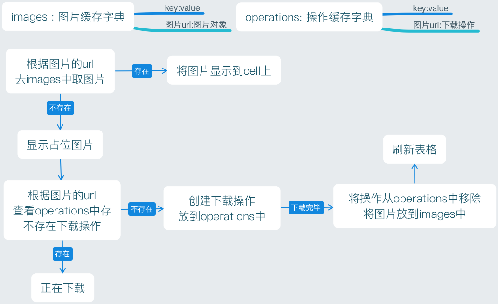
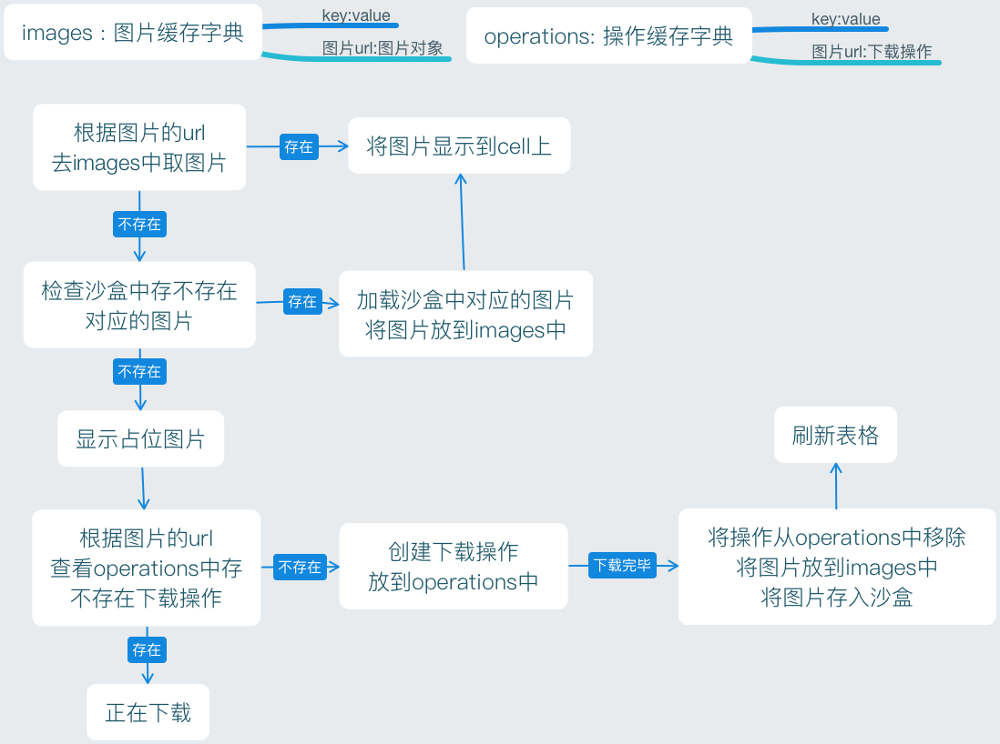

Title: 多线程-NSOperation总结
Date: 2017-05-10 13:23:07
Category: iOS
Tags: 多线程, iOS, NSOperation

概述
====

* 配合使用 NSOperation 和 NSOperationQueue 也能实现多线程编程

## NSOperation 是个抽象类
* 不具备封装操作的能力，必须使用它的子类
* 使用 NSOperation 子类的方式有3种
    * NSInvocationOperation
    * NSBlockOperation
    * 自定义子类继承 NSOperation 将任务封装到内部的 main 方法中

实现多线程的具体步骤
=================

* 将需要执行的操作封装到一个 NSOperation 对象中
* 将 NSOperation 对象添加到 NSOperationQueue 中
* 系统会自动将 NSOperationQueue 中的 NSOperation 取出来
* 将取出的 NSOperation 封装的操作放到一条新线程中执行

具体使用
=======

## NSInvocationOperation

* 创建NSInvocationOperation对象
    * alloc
    * initWithTarget
* 调用start方法开始执行操作
    * start
    * 一旦执行操作，就会调用target的sel方法
* 注意
    * 默认情况下，调用了start方法后并不会开一条新线程去执行操作，而是在当前线程同步执行操作
    * 只有将NSOperation放到一个NSOperationQueue中，才会异步执行操作

## NSBlockOperation

* 创建NSBlockOperation对象, blockOperationWithBlock
* 通过addExecutionBlock:方法添加更多的操作, addExecutionBlock
* 注意 : 只要一个NSBlockOperation对象封装的操作数 > 1，就会异步执行操作

## NSOperationQueue

* 作用
    * NSOperation可以调用start方法来执行任务，但默认是同步执行的
    * 如果将NSOperation添加到NSOperationQueue（操作队列）中，系统会自动异步执行NSOperation中的操作
* 添加操作到NSOperationQueue中
    * addOperation, 内部调用 start 方法, start 方法内部会去调用 main 方法
    * addOperationWithBlock

## 最大并发数

* 同时执行的最大任务数, 同时开3个线程执行3个任务，并发数就是3
* 相关方法
    * maxConcurrentOperationCount
    * setMaxConcurrentOperationCount

## 操作的取消、暂停、恢复

* cancelAllOperations, 取消队列的所有操作
* 也可以调用NSOperation的cancel方法取消单个操作
* setSuspended
    * YES代表暂停队列
    * NO代表恢复队列
* isSuspended, 测试是否暂停

其他使用
=======

## 操作依赖

* NSOperation之间可以设置依赖来保证执行顺序
    * addDependency, 调用者依赖于参数
    * 可以在不同queue的NSOperation之间创建依赖关系
    * 不能相互依赖, 比如A依赖B，B依赖A

## 操作的监听

* 监听一个操作的执行完毕
* 操作的属性, completionBlock

## 自定义NSOperation

* 继承NSOperation创建自己的类
* 重写main方法, 将任务封装到这个main方法中
* 重写注意点
    * 自己创建自动释放池, 因为如果是异步操作，无法访问主线程的自动释放池
    * 通过isCancelled方法检测操作是否被取消，对取消做出响应

例子 : 自定义NSOperation下载图片
=============================

*无沙盒缓存*

*有沙盒缓存*

