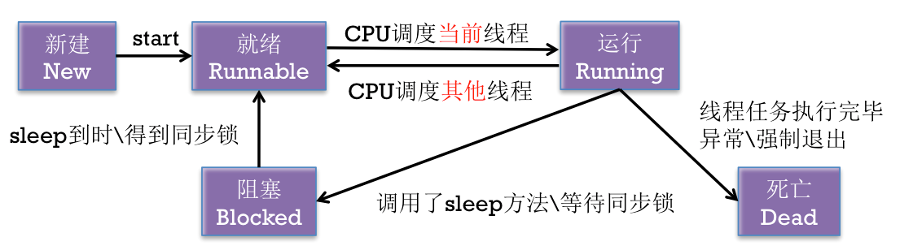

Title: 多线程-基本概念和原理
Date: 2017-05-09 17:42:29
Category: iOS
Tags: 多线程, iOS

进程
====

* 在操作系统中正在运行的一个应用程序
* 每个进程之间是独立的，每个进程均运行在其专用且受保护的内存空间内

线程
====

* 1个进程要想执行任务，必须得有线程
* 每1个进程至少要有1条线程
* 一个进程（程序）的所有任务都在线程中执行
* 线程的串行
    * 1个线程中任务的执行是串行的
    * 如果要在1个线程中执行多个任务，那么只能一个一个地按顺序执行这些任务
    * 在同一时间内，1个线程只能执行1个任务
    * 也可以认为线程是进程中的1条执行路径

*线程的状态*

进程和线程的比较
==============

1. 线程是CPU调用(执行任务)的最小单位
2. 进程是CPU分配资源和调度的单位
3. 一个程序可以对应多个进程，一个进程中可以有多个线程，但至少要有一个线程
4. 同一个进程内的线程共享进程的资源

多线程
=====

* 1个进程中可以开启多条线程，每条线程可以并行（同时）执行不同的任务
* 比喻
    * 进程 : 车间
    * 线程 : 车间工人

* 多线程技术可以提高程序的执行效率, 比如: 同时开启3条线程分别下载3个文件

## 多线程的原理
* 同一时间，CPU只能处理1条线程，只有1条线程在工作（执行）
* 多线程并发（同时）执行，其实是CPU快速地在多条线程之间调度（切换）
* 如果CPU调度线程的时间足够快，就造成了多线程并发执行的假象
* 如果线程非常非常多，会发生什么情况？
    * CPU会在N多线程之间调度，CPU会累死，消耗大量的CPU资源
    * 每条线程被调度执行的频次会降低（线程的执行效率降低）

## 优缺点

### 优点
* 能适当提高程序的执行效率
* 能适当提高资源利用率（CPU、内存利用率）

### 缺点
* 创建线程是有开销的(iOS下主要成本包括: 内核数据结构（大约1KB）、栈空间（子线程512KB、主线程1MB，也可以使用-setStackSize:设置，但必须是4K的倍数，而且最小是16K）、创建线程大约需要90毫秒的创建时间)
* 如果开启大量的线程，会降低程序的性能
* 线程越多，CPU在调度线程上的开销就越大(上下文切换开销)
* 程序设计更加复杂(线程之间的通信 , 多线程间的数据共享)

