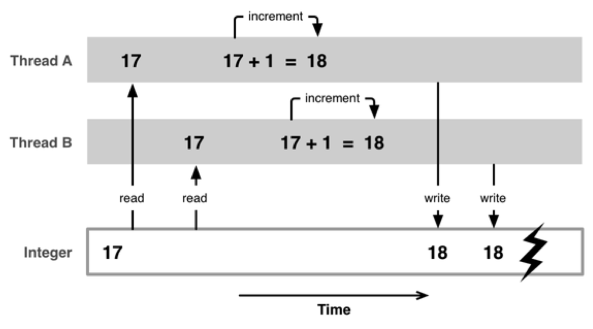
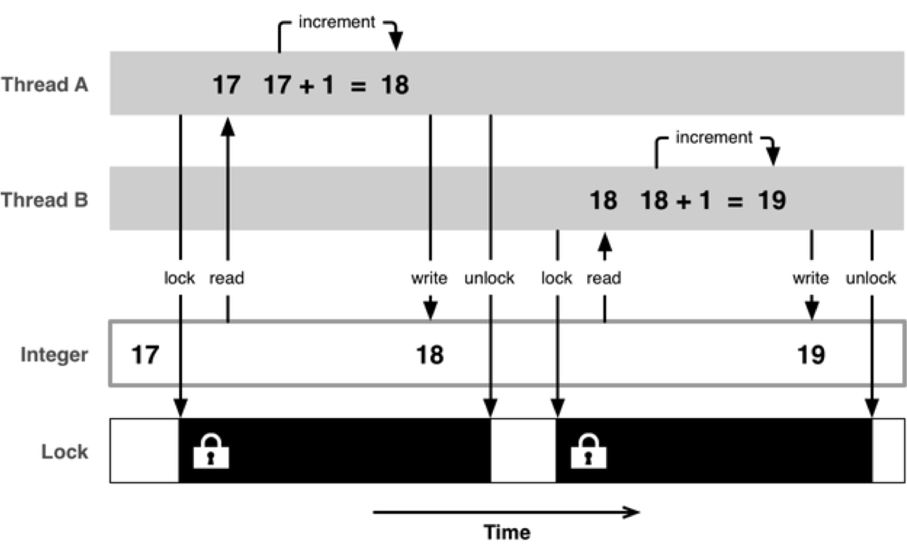

Title: 多线程-安全隐患
Date: 2017-05-09 18:19:40
Category: iOS
Tags: 多线程, iOS

资源共享问题
===========

* 1块资源可能会被多个线程共享，也就是多个线程可能会访问同一块资源
* 比如: 多个线程访问同一个对象、同一个变量、同一个文件
* 当多个线程访问同一块资源时，很容易引发数据错乱和数据安全问题

问题分析与解决
============

## 不加锁

## 安全隐患解决

### 加互斥锁

### 互斥锁使用

* @synchronized(锁对象) {// 需要锁定的代码}
* 锁定1份代码只用1把锁，用多把锁是无效的
* 使用注意点
    * 注意加锁的位置
    * 注意加锁的前提条件 : 多条线程共享同一块资源
    * 注意加锁是需要代价的 : 需要耗费性能
    * 加锁的结果 : 线程同步了

### 互斥锁的优缺点

* 优点 : 能有效防止因多线程抢夺资源造成的数据安全问题
* 缺点 : 需要消耗大量的CPU资源

### 什么时候使用互斥锁

* 多条线程抢夺同一块资源

### 线程同步

* 多条线程在同一条线上执行（按顺序地执行任务）
* 互斥锁，就是使用了线程同步技术
	
原子和非原子属性
==============

## atomic

* 原子属性
* 为setter方法加锁（默认就是atomic）

## nonatomic

* 非原子属性
* 不会为setter方法加锁

## 原子和非原子属性的选择

### nonatomic和atomic对比

* atomic
    * 线程安全
    * 需要消耗大量的资源
* nonatomic
    * 非线程安全
    * 适合内存小的移动设备

### iOS开发的建议

* 所有属性都声明为nonatomic
* 尽量避免多线程抢夺同一块资源
* 尽量将加锁、资源抢夺的业务逻辑交给服务器端处理，减小移动客户端的压力

