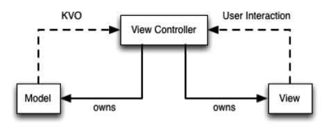
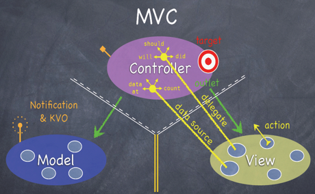
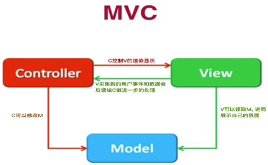

Title: 聊聊 iOS 的 MVC 架构
Date: 2017-05-09 13:35:23
Category: iOS
Tags: 软件架构, iOS, MVC

内容提要
=======

这篇博文, 聊的是软件架构, 主要是 iOS 中的 MVC 架构.

架构基础
=======

## 架构的目的

* 解耦.
* 类之间, 模块之间, 要交互, 就会有耦合. 我们的目标就是将耦合降到最低
* 问题来了, 为什么要解耦呢? 解耦后的好处是什么? 个人总结两点: 1. 方便类和模块的重用; 2. 清晰化类之间、模块之间的逻辑关系, 便于维护、扩展

## 一些基本设计模式

在理解 MVC 这个复合设计模式之前, 有必要对下面的这些基本设计模式有一定的理解.

* 代理(Delegate)
* 通知(Notification)
* 键值观察(KVO)
* 目标动作(Target-Action)
* ...

MVC
===

M : Model, 模型. 存放数据
V : View, 视图. 用户所见, 能给与用户进行交互
C : Controller, 控制器. 处理用户的交互逻辑、处理网络相关逻辑、处理 Model 和 View 的通信逻辑...

下面针对苹果推荐使用的 MVC 设计模式, 给出三张示意图, 这三张图的侧重点不同, 有助于深刻理解 MVC 设计模式.

*典型 MVC*

实线表示持有, 有强指针引用.
虚线表示未持有, 没有强指针引用.

解释:

* Controller 直接强引用 Model 和 View
    * 能对它们进行修改
    * 协调二者之间的通信
* Model 改变时, Controller 通过 KVO 监听这种改变
* View 与用户发生交互时, 通过 Target-Action, 在 Controller 中处理用户的交互

*苹果官方 MVC*

苹果官方的 MVC 架构图, 能理解这幅图, 苹果提供框架的基本使用绝对不是问题, 因为苹果是严格遵守这幅图里面的所有内容的

解释:

* 看到中间的三角叉了吧. 
    * 它对三者间的通信有一个基本的限制. 
    * 白色虚线和白色实线表示虚线方可以引用非虚线方, 反之则不行. 
    * 黄色双实线表示禁止双方进行任何引用和通信
* Controller 和 Model 间的通信. 
    * Notification
    * KVO
* Controller 和 View 间的通信. 
    * Controller 通过 delegate 获取 View 上的事件
    * Controller 通过 data source 为 View 提供数据
    * Target-Action: 目标是 Controller, 动作发生在 View 上. 也就是用户交互行为发生在 View 上, 但处理这个交互行为的是控制器.

  *iOS 开发者常用 MVC*
  
  
  
  为什么说这是 iOS 开发者常用 MVC 模式? 因为它方便、快速, 各个模块逻辑还算清晰, 也基本满足软件的单一职责原则, 如果真安苹果的 MVC 设置软件, 软件的重用性不用说, 但是软件的前期工作量也会大大增大. 
  在理解了上面两幅图后, 这幅肯定不在话下, 在此不做解释了.

