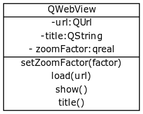

Title: PyQt5 browser
Date: 2017-10-12 17:38:17
Category: PyQt
Tags: PyQt, Python

> browser

> PyQt5 supports a widget that displays websites named QWebView.

> QWebView uses the Webkit rendering engine
The web browser engine is used by Safari, App Store and many OS X applications.

> The load() method opens the url (QUrl) in the argument. You can create a QUrl using: QUrl(url).

> The show() method is required to display the widget.



```python
import sys
from PyQt5 import QtCore, QtGui, QtWidgets
from PyQt5.QtCore import *
from PyQt5.QtGui import *
from PyQt5.QtWidgets import *
# PyQt 5.6(+) 写法改变
from PyQt5.QtWebEngineWidgets import *
from PyQt5.QtWidgets import QApplication, QWidget, QMainWindow

app = QApplication(sys.argv)

web = QWebEngineView()
web.load(QUrl("https://www.baidu.com"))
web.show()

sys.exit(app.exec_())
```


