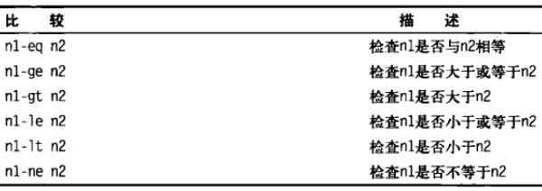
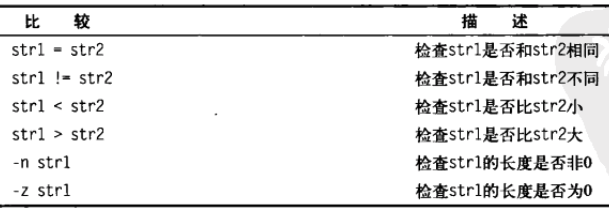
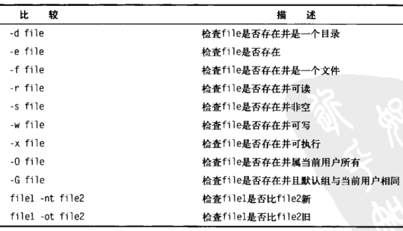
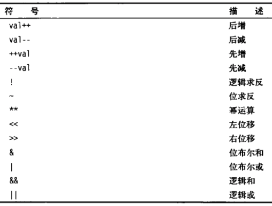

Title: shell 控制语句
Date: 2017-08-13 09:53:11
Category: shell
Tags: shell

if-then语句
==========

* bash 的 if 语句会运行 if 行定义的那个命令. 如果命令的退出状态码是0, 位于 then 部分的命令会被执行

```bash
if command
then
   commands
fi
```

```bash
if command; then
   commands
fi
```

if-then-else语句
==========

```bash
if command
then
   commands
else
   commands
fi
```

嵌套 if
=======

```bash
if command1
then
   commands
elif command2
then
   commands
fi
```

test 命令
========

* 如果 test 命令中列出的条件成立, test 命令就会退出并返回状态码 0

```bash
test condition
```

```bash
if test condition
then
   commands
fi
```

```bash
# test 命令的简写形式
# 方括号定义了 test 命令中用到的条件
# condition 左右的空格是必须的
if [ condition ]
then
   commands
fi
```

## 数值比较

**数值比较**



```bash
if [ $val -gt 5 ]
then
   echo "The test value $val is greater than 5"
fi
```

## 字符串比较

**字符串比较**



* 字符串大小比较
  * 大于小于符号必须转义, 因为它们和重定向符号冲突
  * 大于小于顺序和sort命令所采用的不同. 在 test 命令中, 大写字母小于小写字母. sort 命令, 则相反. test 命令使用标准的 ASCII 顺序. sort 命令使用系统的本地化语言设置中定义的排序顺序.

## 文件比较

**文件比较**



## 复合条件测试

* [ condition1 ] && [ condition2 ]
* [ condition1 ] || [ condition2 ]

if-then 的高级特性
================

## 使用双尖括号

* 任意的数学`赋值`或`比较`表达式

```bash
# 可以放入类似C语言中的高级数学表达式
(( expression ))
```

**双尖括号命令符号**



## 使用双方括号

* 支持 test 命令中的标准字符串比较
* 高级特性 : 模式匹配. 也就是你可以定义一个正则表达式来匹配字符串

```bash
[[ expression ]]
```

```bash
if [[ $USER == r* ]]
then
  echo Hello
fi
```

case 命令
========

```bash
# 一旦某个模式匹配了, 后面的模式将不会再进行匹配
case variable in
pattern1 | pattern2) commands1;;
pattern3) commands2;;
*) default commands;;
esac
```

for 命令
=======

```bash
for var in list
do
  commands
done
```

* list 中有特殊字符, 可以使用转义, 或使用引号括起来


## 从变量读取列表

```bash
list="Alabama Alaska Colorado"
# 向变量中添加文本字符串
list=$list" Arizona"
for state in $list
do
  echo $state
done
```

## 从命令读取值

```bash
file="states"
for state in `cat $file`
do
  echo "Visit beautiful $state"
done
```

## 更改字段分隔符

> IFS 内部字段分隔符, 这个 bash 环境变量保存用作 bash 字段分隔符的字符. 默认的字段分隔符是: 空格、制表符、换行符

* 可以在 shell 脚本中改变 IFS的值, 当退出 shell 脚本时, IFS 会恢复默认值
* 当在一个脚本中, 需要恢复默认值时, 可以使用一个变量暂存

```bash
# 仅仅换行符
IFS=$'\n'
```

```bash
# shell 中暂存
IFS.OLD=$IFS
IFS=$'\n'
# code
IFS=$IFS.OLD
```

```bash
# 指定多个分隔符
IFS=$'\n:;' # 换行符、冒号、分号
```

## 使用通配符读取目录

* 使用 for 命令遍历目录中的文件, 可以使用通配符
* 文件扩展通配 : 生成匹配指定的通配符的文件名或路径名的过程

```bash
for file in /home/rich/test/*
do
  if [ -d "$file" ]
  then
    echo "$file is a directory"
  elif [ -f "$file" ]
  then
    echo "$file is a file"
  fi
done
```

```bash
# 在 for 命令中通过列出一系列的目录通配符来将目录查找方法和列表方法合并到同一个 for 语句中
for file in /home/rich/.b* /home/rich/badtest
do
  if [ -d "$file" ]
  then
    echo "$file is a directory"
  elif [ -f "$file" ]
  then
    echo "$file is a file"
  fi
done
```

C语言风格的 for 命令
==================

```bash
for (( variable assignment; condition; iteration process ))
```

```bash
# C 风格 for 命令
for (( i = 1; i <= 10; ++i ))
do
  echo "The next number is $i"
done
```

```bash
# 使用多个变量
for (( a = 1, b = 10; a <= 10; ++a, --b ))
do
  echo "$a - $b"
done
```

while 命令
=========

```bash
while test command
do
  other commands
done
```

```bash
var1=10
while [ $var1 -gt 0 ]
do
  echo $var1
  var1=$[ $var1 - 1 ]
done
```

## 使用多个测试命令

* 只有最后一个测试命令的退出状态码会被用来决定什么时候结束循环

```bash
var1=10
while echo $var1
      [ $var1 -gt 0 ]
do
  echo "This is inside the loop"
  var1=$[ $var1 - 1 ]
done
```

until 命令
==========

* until 命令和while 命令工作的方式完全相反.
* 退出状态码非零, 循环执行; 退出状态码为零, 循环结束

```bash
until test commands
do
  other commands
done
```

嵌套循环
=======

* 循环套循环

控制循环
=======

## break

* 跳出当前层循环

```bash
break
```

* 跳出指定层级的外部循环

```bash
# 默认 n 为 1, 向外递增
break n
```

## continue

* 继续当前层循环

```bash
continue
```

* 继续指定层级的外部循环

```bash
# 默认 n 为 1, 向外递增
continue n
```

处理循环的输出
===========

* shell 中处理输出, 要么管接, 要么重定向

```bash
# done 后添加一个处理命令来处理输出
for file in /home/rich/*
do
  # code
done > output.txt
```

