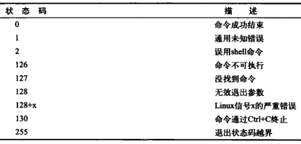

Title: shell 脚本编程基础
Date: 2017-08-12 11:47:30
Category: shell
Tags: shell

基础
====

* 同`一行多个命令`顺序执行, 使用`;`

```bash
data;who
```

* 创建shell脚本文件
* 在文件的`第一行指定`要使用的`shell`

```bash
#!/bin/bash
```

* 显示消息

```bash
echo This is a test
echo Let\'s see if "this'll" work
echo "Let's see if this'll work"
echo 'Rich says "scripting is easy".'
# -n : 不输出末尾的 newline 字符
echo -n "The time and date are: ";date
```

* 环境变量 : shell维护者一组环境变量, 用来记录特定的系统信息.

```bash
$PATH
```

* 用户变量

```bash
# 区分大小写
# 变量、等号和值之间不能出现空格
# shell自动决定变量值的数据类型
# 变量的生命周期: 从创建时开始到shell脚本完成时删除掉
var1=10
```

```bash
# 变量每次引用时, 都会输出当前赋给它的值
# 引用变量来使用其值时, 需要使用 $
# 引用变量来对其赋值时, 不需要使用 $
value1=10
value2=$value1
```

* 反引号 : 将 shell 命令的输出赋给变量

```bash
testing=`date`
today=`date +%y%m%d`
```

* 输出重定向

```bash
# 将命令输出重定向到一个文件
# 文件不存在创建
# 文件存在就覆盖
# 覆盖输出重定向
date > test
# 文件不存在创建
# 追加重定向
date >> test
```

* 输入重定向

```bash
# 将文件内容重定向到命令
wc < test
```

```bash
# 内联输入重定向
# 可以在命令行指定输入重定向的数据
# 使用 << 
## 需要指定一个文本标记来划分要输入数据的开始和结尾
wc << EOF
test string 1
test string 2
test string 3
EOF
```

* 管道

```bash
# Linux 系统会同时运行这两个命令, 在系统内部将它们连接起来
# 可以在一条命令中使用任意多条管道
rpm -qa | sort
```

* 退出脚本

> shell 中运行的每个命令都使用退出状态码来告诉 shell 它完成了处理. 退出状态码是一个 0~255 之间的整数值, 在命令结束运行时由命令传给 shell.
> 0 : 成功结束
> 非0 : 结束时有错误
> shell 脚本以脚本的最后一个命令的退出状态码退出

```bash
data
# $? 专属变量保存上一个命令的退出状态码
echo $?
```

**Linux退出状态码**



```bash
# exit 命令允许在脚本退出时指定一个退出状态码
# 范围 0~255
# 超出范围会与256取模
exit 5
```

