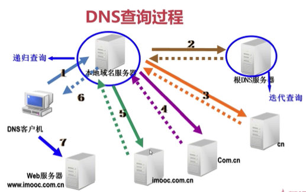

Title: 网络基本概念
Date: 2017-05-07 21:37:55
Category: 计算机网络
Tags: 计算机网络, 网络

## 物理地址
* 又名: MAC地址, 网卡硬件地址
* 作用: 用于局域网内的通信
* 48位

## IP地址
* IP 协议: Internet Protocol
* IP 协议版本: IPv4(不定长包头、解析耗时); IPv6(定长包头)
* 32位: 8位一组共4组(X1.X2.X3.X4, 0.0.0.0->255.255.255.255)
* 分类
    * 用 IP 的第一位对网络进行分类
    * 每个网段的主机数用子网掩码确定
    * 每个网络的第一个地址代表网络本身
    * 每个网络的最后一个地址代表网络的广播地址(广播地址是专门用于同时向网络中所有工作站进行发送的一个地址)

* 子网掩码

## 端口
* 属于传输层: 在传输层包头中(TCP头, UDP头)
* 端口号
    * IP全球唯一类似于门牌号: 确定服务器位置
    * 端口号类似于写信时的收件人: 确定要使用服务器上的哪个服务
    * 访问端口即对应的服务

* 端口号的分类: TCP端口号; UDP端口号
* 常见端口号
    * FTP: 文件传输协议, 端口号: 20 21
    * SSH: 安全shell协议, 端口号: 22
    * Telnet: 远程登录协议, 端口号: 23, 一般系统都禁止开启这个服务(不安全, 明文传递)
    * DNS: 域名系统, 端口号: 53
    * http: 超文本传输协议, 端口号: 80
    * SMTP: 简单邮件传输协议, 端口号: 25
    * POP3: 邮局协议3代, 端口号: 110
    * 常见端口号为TCP和UDP通用
* 作用
    * 用于表示计算机上的服务
    * 通过端口号可以确定计算机上开启了哪些服务
* 16位
    * TCP和UDP各有65535个
    * 10000以内的是常见的端口号
    * 大于10000的可以作为自己的程序的端口号
* 查看本机开启的端口
    * netstat -an: a: all; n: 只显示IP和端口号
    * status:LISTEN(被监听), ESTABLISHED(建立连接), TIME_WAIT(等待), UDP下没有, 因为UDP不需要建立连接, 所以没有状态

## Socket
* IP:端口号

## DNS
* Domain Name System
* DNS服务的作用: 域名 => IP
* hosts文件
    * 作用: 做静态IP和域名对应
    * 其优先级高于DNS解析
    * Mac上的位置: /private/etc/hosts
* 从 Hosts 文件到 DNS
    * 早期Hosts文件解析域名(名称解析效能下降, 主机维护困难)
    * DNS服务(层次性, 分布式)
* 工作过程
    * 大致流程(客户机向DNS服务器发送域名查询请求->DNS服务器告知客户机Web服务器的IP地址->客户机与Web服务器通信)
    * DNS查询过程

  

    * 从查询方式上分
        * 递归查询(要么做出查询成功的响应, 要么做出查询失败的响应; 一般客户机和服务器之间属递归查询, 当客户机向DNS服务器发出请求后, 若DNS服务器本身不能解析, 则会向另外的DNS服务器发出查询请求, 得到结果后转交给客户机)
        * 迭代查询(服务器收到一次迭代查询回复一次结果, 这个结果不一定是目标IP与域名的映射关系, 也可以是其他DNS服务器的地址)
    * 从查询内容上分
        * 正向查询由域名查找IP地址
        * 反向查询由IP地址查找域名
* 域名空间结构
    * 根域名(`.`根域名的服务器全球只有13台)
    * 顶级域名: 组织域、国家或地区域; 由域名分配组织ISO决定
    * 二级域名
    * 三级域名: 申请完二级域名后自己规定的
    * 三级域名+二级域名+顶级域名组成完整域名空间, 域名必须全球唯一
    * 使用这种结构的原因
        * 互联网中的域名是有结构有规划的
        * 域名进行了分级
        * 在进行域名和IP地址解析时才能更容易找到

*组织域*

*国家或地区域*

## 数据封装与解封

## 交换机
* 同一网络通信
* 局域网通信
* 认识MAC地址, 不认识IP地址
* 工作在数据链路层
* 知道当前连接到这个交换机(局域网)的所有电脑的网卡硬件地址(MAC地址, 物理地址)

## 路由器
* 路由器认识 IP 地址, 用于跨网络通信
  
## 网关

### 作用
1. 网关(Gateway)又称网间连接器、协议转换器
2. 网关在网络层以上实现网络互连, 是最复杂的网络互连设备, 仅用于两个高层协议不同的网络互连
3. 网关既可以用于广域网互连, 也可以用于局域网互连
4. 网关是一种充当转换重任的服务器或路由器, 内网IP=>公网IP

### 通俗定义
* 具有路由功能的这么一个设备
* 一般是一台路由器, 也可以在服务器上搭建路由的功能, 进而充当网关的作用
* 网关是有多级的

### 网关到底做了什么?
* 网关在所有内网计算机访问的不是本网段(本局域网)的数据报时使用
* 网关负责将内网IP转换为公网IP, 公网IP转换为内网IP
* 总结
    * 本局域网发送数据报, 不使用网关. 只要不是本局域网发送数据包, 全都要交给网关处理. 
    * 网关怎么处理: 1. 内网IP转换为公网IP 2. 通过公网IP就可以访问公网了

### 实例
* 示意图

* 你<==>PLMM
    * 同一局域网, 通过交换机记录的MAC地址进行通信
    * 不需要通过网关处理
* 你<==>MM2
    * 不同网络
    * 需要通过网关处理

