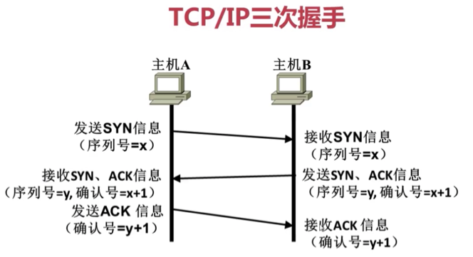
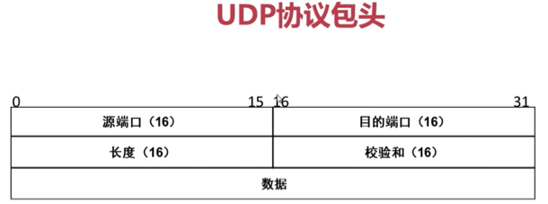
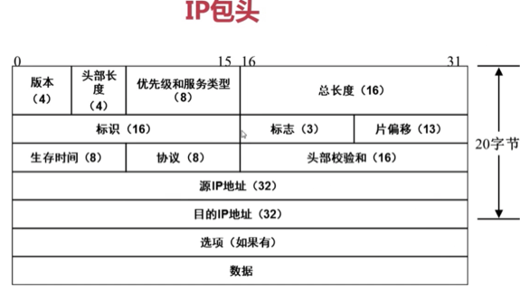

Title: 网络模型
Date: 2017-05-07 22:26:25
Category: 计算机网络
Tags: 计算机网络, 网络

# OSI七层模型

## 1. 应用层

* 数据单位: APDU
* 作用: 针对用户(应用程序)

## 2. 表示层

* 数据单位: PPDU
* 作用: 数据的编码、加密和解压缩等
    
## 3. 会话层

* 数据单位: SPDU
* 作用: 确定数据是否向下传递

## 4. 传输层

* 数据单位: TPDU
* 作用: 确定数据是否可靠; 确定网络端口是否可靠; 查错、校验; 流量控制等等
    
## 5. 网络层

* 数据单位: 报文, 报文中有 IP 地址
* 作用: 确定IP地址编码
    
## 6. 数据链路层

* 数据单位: 帧, 帧中最重要的数据就是MAC地址
* 作用: MAC地址编码
    
## 7. 物理层

* 数据单位: 比特
* 作用: 实际的数据传递     
    
---

## 说明
* 上3层给用户提供服务, 所有软件都会用(包括PPT这类不用联网就能用的软件)
* 下4层为传送数据提供服务, 只有需要网络传输的软件才会用

# TCP/IP 四层模型

## 1. 应用层

* 对应七层模型: 应用层; 表示层; 会话层
* 作用: 为用户提供各种具体服务(FTP, Telnet, DNS, SMTP)
    
## 2. 传输层

* 对应七层模型: 传输层
* 作用:     
    * 为应用层实体提供端到端的通信功能
    * 保证数据包的顺序传送及数据的完整性; 确定发送和接收端口号
    * 查错、校验、流量控制
    * 最重要的就是确定TCP包头和UDP包头
* 主要协议:     
    * 传输控制协议TCP
      
        * 3 次握手
      
        
      
        * 可靠的面向连接的协议
        * 类似: 打电话
        * 传输数据过程中始终有交流, 有错误就要求对方重发
        * 应用: 网页, 邮件...
        * 优点: 数据安全可靠
        * 缺点: 慢
      
    * 用户数据报协议UDP
      
        * 不可靠的面向无连接的协议
        * 类似: 发短信
        * 不管对方能否接受直接发送
        * 应用: QQ
        * 优点: 快
        * 缺点: 数据可能丢失

* 传输层头内容: 主要是`端口`

    
    
    

## 3. 网际互连层

* 对应七层模型: 网络层
* 作用: 
    * 解决主机到主机的通信问题
    * 其协议设计数据包在整个网络上的逻辑传输

* 主要协议
    * 网际协议IP: 源IP,目的IP; 确定数据在公网上如何发送
    * 互联网组管理协议IGMP
    * 互联网控制报文协议ICMP: ping命令利用了这个协议
* 网际层头: 主要是`IP`

    

## 4. 网络接口层
* 对应七层模型: 数据链路层; 物理层
* 作用:
    * 负责监视数据在主机和网络之间交换
    * 地址解析协议(ARP)工作在此层(七层中的数据链路层)
    * arp指令: 将IP翻译成对应的MAC地址; 翻译的目的(外网通信用IP, 局域网通信用MAC, 交换机值识别MAC地址)

* 网络层头: 主要是`MAC`, 又名`以太帧头`

# 七层模型与四层模型的比较

## 共同点
* 都采用了层次结构的概念
* 分层设计
* 都能够提供面向连接和无连接两种通信服务机制

## 不同点
* 一个七层一个四层
* 对可靠性要求不同
* 七层模型具有通用性: 在协议开发前设计的
* 四层模型是先有协议集后在建立模型: 不适用于非 TCP/IP 网络
* 实际市场应用不同: 七层只是理论模型, 无成熟产品; TCP/IP已成为实际上的国际标准

